# AGENT.md — Hack Nation: Bridging Medical Deserts (Databricks Track)

---

## Mission Statement

Build an **Intelligent Document Parsing (IDP) Agent** that extracts, verifies, and reasons over medical facility data from Ghana (provided by the Virtue Foundation) to identify **medical deserts** and infrastructure gaps. The system must parse unstructured free-form text, synthesize it with structured facility schemas, detect anomalies, and present findings through an interactive map + natural language planning interface.

---

## Evaluation Criteria

| Criterion              | Weight  | What Wins                                                                                                                              |
| ---------------------- | ------- | -------------------------------------------------------------------------------------------------------------------------------------- |
| **Technical Accuracy** | **35%** | Agent reliably handles "Must Have" queries from the question bank. Detects anomalies in facility data.                                 |
| **IDP Innovation**     | **30%** | Extracts + synthesizes info from unstructured free-form text (procedure, equipment, capability columns). Goes beyond keyword matching. |
| **Social Impact**      | **25%** | Effectively identifies medical deserts. Aids resource allocation decisions. Compelling narrative.                                      |
| **User Experience**    | **10%** | Intuitive for non-technical NGO planners. Natural language interface.                                                                  |

---

## Architecture — Databricks-Native

The challenge recommends this base stack:

> **Agentic orchestrator:** LangGraph, LlamaIndex, CrewAI
> **ML lifecycle:** MLflow
> **RAG:** Databricks, FAISS, LanceDB
> **Text2SQL:** Genie

Our architecture: **LangGraph** orchestrates a multi-agent graph locally. Each agent node calls **Databricks Free Edition** services as tools. **MLflow** traces every step. **Streamlit** renders the frontend.


### How Each Databricks Feature Maps to the Challenge

| Challenge Requirement | Databricks Feature | What It Does | Docs |
|---|---|---|---|
| **Structured queries** (counts, aggregations) | **Genie** (Text-to-SQL) | Takes natural language, generates SQL, executes against Delta table, returns results | [docs.databricks.com/en/genie](https://docs.databricks.com/en/genie/) |
| **Semantic search** over free-form text | **Mosaic AI Vector Search** | Auto-embeds procedure/equipment/capability columns, returns top-k matches by semantic similarity | [docs.databricks.com/en/generative-ai/vector-search](https://docs.databricks.com/en/generative-ai/vector-search) |
| **Anomaly detection** (procedure-equipment gaps) | **Model Serving** (Llama 3.3 70B) | LLM reasons over facility data to detect mismatches between claimed procedures and listed equipment | [docs.databricks.com/en/machine-learning/model-serving](https://docs.databricks.com/en/machine-learning/model-serving) |
| **Data storage** with governance | **Unity Catalog** | Managed Delta table with column descriptions — makes Genie smarter and shows data governance | [docs.databricks.com/en/data-governance/unity-catalog](https://docs.databricks.com/en/data-governance/unity-catalog) |
| **IDP extraction** (structured facts from free-form text) | **Vector Search** + **Model Serving** | Retrieves raw free-form text, then LLM extracts structured facts (procedures, equipment, capabilities) using sponsor's extraction prompts | [resources/prompts_and_pydantic_models/free_form.py](resources/prompts_and_pydantic_models/free_form.py) |
| **Citation trail** (which data produced each answer) | **MLflow Tracing** | Logs inputs/outputs of each step, creating an audit trail of which rows were used | [docs.databricks.com/en/mlflow](https://docs.databricks.com/en/mlflow) |
| **Data cleaning** + geocoding | **Notebooks** | Python notebook for one-time CSV cleaning, region normalization, geocoding, upload to Unity Catalog | [docs.databricks.com/en/notebooks](https://docs.databricks.com/en/notebooks) |

### What Runs Where

| Component | Runs On | Technology | Docs |
|---|---|---|---|
| **Agent orchestration** | Local | LangGraph (state graph with supervisor routing) | [langchain-ai.github.io/langgraph](https://langchain-ai.github.io/langgraph/) |
| **Frontend** | Local | Streamlit + Folium map | [docs.streamlit.io](https://docs.streamlit.io/) |
| **Geospatial** | Local | Python Haversine + numpy | — |
| **Text-to-SQL** | Databricks | Genie | [docs.databricks.com/en/genie](https://docs.databricks.com/en/genie/) |
| **RAG / Semantic search** | Databricks | Vector Search | [docs.databricks.com/en/generative-ai/vector-search](https://docs.databricks.com/en/generative-ai/vector-search) |
| **LLM inference** | Databricks | Model Serving (Llama 3.3 70B) | [docs.databricks.com/en/machine-learning/model-serving](https://docs.databricks.com/en/machine-learning/model-serving) |
| **Agent tracing** | Databricks | MLflow Tracing | [docs.databricks.com/en/mlflow](https://docs.databricks.com/en/mlflow) |
| **Data storage** | Databricks | Unity Catalog Delta table | [docs.databricks.com/en/data-governance/unity-catalog](https://docs.databricks.com/en/data-governance/unity-catalog) |

---

## Tech Stack

| Layer | Technology | Docs |
|---|---|---|
| **Agent Orchestration** | **LangGraph** (multi-agent state graph) | [langchain-ai.github.io/langgraph](https://langchain-ai.github.io/langgraph/) |
| **Data Storage** | Databricks Unity Catalog (Delta table) | [docs.databricks.com/en/data-governance/unity-catalog](https://docs.databricks.com/en/data-governance/unity-catalog) |
| **Text-to-SQL** | Databricks Genie | [docs.databricks.com/en/genie](https://docs.databricks.com/en/genie/) |
| **RAG / Semantic Search** | Databricks Mosaic AI Vector Search | [docs.databricks.com/en/generative-ai/vector-search](https://docs.databricks.com/en/generative-ai/vector-search) |
| **LLM** | Databricks Model Serving (Llama 3.3 70B) | [docs.databricks.com/en/machine-learning/model-serving](https://docs.databricks.com/en/machine-learning/model-serving) |
| **Embeddings** | Databricks `gte-large-en` (auto via Vector Search) | [docs.databricks.com/en/generative-ai/vector-search](https://docs.databricks.com/en/generative-ai/vector-search) |
| **ML Lifecycle / Tracing** | MLflow Tracing | [docs.databricks.com/en/mlflow](https://docs.databricks.com/en/mlflow) |
| **Data Cleaning** | Databricks Notebooks (Python + Spark SQL) | [docs.databricks.com/en/notebooks](https://docs.databricks.com/en/notebooks) |
| **Frontend** | Streamlit | [docs.streamlit.io](https://docs.streamlit.io/) |
| **Map** | Folium + streamlit-folium | [python-visualization.github.io/folium](https://python-visualization.github.io/folium/) |
| **Geospatial** | Python (Haversine, numpy) — local | — |
| **Language** | Python 3.13 | — |

### .env.example

```bash
# === Databricks (primary backend) ===
DATABRICKS_HOST=https://your-workspace.cloud.databricks.com
DATABRICKS_TOKEN=dapi...                       # Personal Access Token
DATABRICKS_CATALOG=your_catalog                # Unity Catalog name
DATABRICKS_SCHEMA=your_schema                  # Schema within catalog
GENIE_SPACE_ID=...                             # From Genie Space setup
VECTOR_SEARCH_INDEX=your_catalog.your_schema.ghana_facilities_index
VECTOR_SEARCH_ENDPOINT=ghana-medical-vs

# === LLM (fallback if Model Serving quota exceeded) ===
OPENAI_API_KEY=sk-...                          # Optional fallback
```

### requirements.txt

```
# Agent orchestration
langgraph==1.0.8
langchain==1.2.9
langchain-openai==1.1.7

# Databricks SDK
databricks-sdk==0.85.0
databricks-vectorsearch==0.64
mlflow==3.9.0

# Frontend
streamlit==1.54.0
streamlit-folium==0.26.1
folium==0.20.0

# Data (local utilities)
pandas==3.0.0
numpy==2.4.2
python-dotenv==1.2.1

# Testing
pytest==9.0.2
```

### Project Structure

```
Hack-Nation/
├── AGENT.md
├── README.md
├── requirements.txt
├── .env.example
├── .gitignore
├── resources/
│   └── prompts_and_pydantic_models/   # Sponsor-provided extraction pipeline (read-only reference)
│       ├── organization_extraction.py # Entity classification → facility / NGO / other
│       ├── facility_and_ngo_fields.py # Structured field schemas (Facility, NGO, BaseOrganization)
│       ├── free_form.py               # FacilityFacts: procedure, equipment, capability
│       └── medical_specialties.py     # Specialty classifier + name-parsing rules
├── data/
│   └── ghana_city_coords.json        # Static geocoding lookup (local)
├── src/
│   ├── app.py                        # Streamlit entry point
│   ├── config.py                     # Load .env, Databricks client init
│   ├── graph.py                      # LangGraph state graph definition (supervisor + nodes)
│   ├── state.py                      # Pydantic state schema for the agent graph
│   ├── nodes/
│   │   ├── supervisor.py             # Supervisor node — classifies intent, routes to agents
│   │   ├── sql_agent.py              # SQL Agent node — calls Databricks Genie
│   │   ├── rag_agent.py              # RAG Agent node — calls Databricks Vector Search
│   │   ├── idp_extraction.py         # IDP Extraction node — extracts structured facts from free-form text
│   │   ├── medical_reasoning.py      # Medical Reasoning node — anomaly detection via Model Serving
│   │   ├── geospatial.py             # Geospatial node — Haversine, cold-spots, medical deserts
│   │   └── synthesis.py              # Synthesis node — cross-references structured vs unstructured + citations
│   ├── tools/
│   │   ├── genie_tool.py             # Databricks Genie SDK wrapper
│   │   ├── vector_search_tool.py     # Databricks Vector Search SDK wrapper
│   │   └── model_serving_tool.py     # Databricks Model Serving SDK wrapper
│   ├── databricks_clients.py         # Shared Databricks client initialization
│   └── map_component.py              # Folium map builder
├── tests/
│   ├── test_config.py               # Phase 1: Databricks connection smoke test
│   ├── test_tools.py                # Phase 1: Genie, Vector Search, Model Serving smoke tests
│   ├── test_graph.py                # Phase 2: Graph compiles + intent routing
│   ├── test_nodes.py                # Phase 2: Node contract tests (expected state keys)
│   ├── test_idp_extraction.py       # Phase 2: IDP extracts structured facts
│   ├── test_geospatial.py           # Phase 3: Haversine + desert detection math
│   └── test_e2e.py                  # Phase 2.5 MVD gate: 5 demo queries
└── notebooks/
    └── 01_setup_databricks.py        # Run once in Databricks: clean → upload → index → Genie
```

---

## Dataset Analysis (987 Rows)

### File: `Virtue_Foundation_Ghana_v0_3_-_Sheet1.csv`

- **987 rows** total: **920 facilities** + **67 NGOs**
- Download: https://drive.google.com/file/d/1qgmLHrJYu8TKY2UeQ-VFD4PQ_avPoZ3d/view

### Critical Data Issues (Handle in Notebook)

1. **NO LATITUDE/LONGITUDE** — Geocode from `address_city` using a static lookup table
2. **Sparse structured fields** — capacity (23 rows), numberDoctors (3 rows), area (2 rows)
3. **Dirty region names** — 53 variations for 16 regions. Normalize in notebook before upload
4. **71 duplicate facility names** — Deduplicate by name + city, merge parsed arrays
5. **Typo: "farmacy"** — Fix to "pharmacy" (5 records)
6. **Free-form fields are JSON strings** — Parse with `json.loads()` in notebook

### Column Coverage

| Field                 | Coverage | Notes |
| --------------------- | -------- | ----- |
| name                  | 100%     | |
| specialties           | 92%      | |
| capability            | 94%      | 784 have >0 items |
| procedure             | 79%      | 202 have >0 items |
| equipment             | 73%      | 91 have >0 items |
| address_city          | 94%      | |
| address_stateOrRegion | **26%**  | Very sparse — infer from city |
| facilityTypeId        | 73%      | |
| capacity              | **2%**   | Almost empty |
| numberDoctors         | **<1%**  | Almost empty |

### Free-Form Text Format

```json
["Performs emergency cesarean sections", "Offers hemodialysis treatment 3 times weekly"]
["Optical Coherence Tomography (OCT) machine", "Fundus photography equipment"]
["Emergency services operate 24/7", "Has 87 French and Ghanaian medical professionals"]
```

---

## Implementation — Milestone-Based

```mermaid
gantt
    title Hackathon Sprint
    dateFormat X
    axisFormat %s

    section Foundation — Databricks Setup
    Notebook: clean + geocode + upload to UC     :p1a, 0, 40
    Create Vector Search index                   :p1b, after p1a, 20
    Configure Genie Space                        :p1c, after p1b, 20

    section Core — LangGraph + Databricks Wiring
    LangGraph state + graph scaffold             :p2a, after p1c, 20
    Supervisor node + intent classification      :p2b, after p2a, 20
    SQL Agent node (Genie)                       :p2c, after p2b, 20
    RAG Agent node (Vector Search)               :p2d, after p2c, 20
    Medical Reasoning node (Model Serving)       :p2e, after p2d, 20
    Synthesis node + Streamlit wiring            :p2f, after p2e, 20

    section MVD Checkpoint
    Minimum Viable Demo MUST work                :milestone, crit, after p2f, 0

    section Surface — Map + Deserts + Planning
    Folium map with facility markers             :p3a, after p2f, 20
    Medical desert overlay (25% of score!)       :p3b, after p3a, 30
    Planning dashboard — Mission Planner tab     :p3c, after p3b, 30
    MLflow tracing + citations                   :p3d, after p3c, 20
    Error handling + polish                      :p3e, after p3d, 20

    section Stretch
    Agentic-step-level citations (MLflow)        :p4a, after p3e, 30
    Composite fan-out queries                    :p4b, after p4a, 30
    PDF export for planning report               :p4c, after p4b, 20
```



### Foundation — Databricks Setup (Notebook)

**Run `notebooks/01_setup_databricks.py` once in a Databricks notebook.** This does all data work on Databricks — no local data pipeline needed.

#### Step 1: Upload + Clean Data

Ref: [Unity Catalog — Managed Tables](https://docs.databricks.com/en/data-governance/unity-catalog/create-tables.html)

```python
import pandas as pd
from pyspark.sql import functions as F

# Upload CSV to a Volume, then read
df = spark.read.csv(
    "/Volumes/your_catalog/your_schema/data/ghana_facilities.csv",
    header=True, inferSchema=True
)

# Fix typo
df = df.withColumn("facilityTypeId",
    F.when(F.col("facilityTypeId") == "farmacy", "pharmacy")
     .otherwise(F.col("facilityTypeId")))

# Normalize region names
region_map = {
    "Greater Accra Region": "Greater Accra", "Accra": "Greater Accra",
    "ASHANTI": "Ashanti", "Ashanti Region": "Ashanti",
    "Western Region": "Western", "Central Region": "Central",
    # ... (full map in AGENT.md data section)
}
mapping_expr = F.create_map([F.lit(x) for kv in region_map.items() for x in kv])
df = df.withColumn("region_normalized", mapping_expr[F.col("address_stateOrRegion")])

# Save as managed Delta table
df.write.format("delta").mode("overwrite").saveAsTable("your_catalog.your_schema.ghana_facilities")
```

#### Step 2: Add Column Descriptions (Critical for Genie)

Ref: [ALTER TABLE — Column Comments](https://docs.databricks.com/en/sql/language-manual/sql-ref-syntax-ddl-alter-table.html)

```sql
ALTER TABLE your_catalog.your_schema.ghana_facilities
  ALTER COLUMN name COMMENT 'Official name of healthcare facility or NGO';
ALTER TABLE your_catalog.your_schema.ghana_facilities
  ALTER COLUMN procedure COMMENT 'JSON array of clinical procedures — surgeries, diagnostics, screenings';
ALTER TABLE your_catalog.your_schema.ghana_facilities
  ALTER COLUMN equipment COMMENT 'JSON array of medical devices — MRI, CT, X-ray, surgical tools';
ALTER TABLE your_catalog.your_schema.ghana_facilities
  ALTER COLUMN capability COMMENT 'JSON array of care levels — trauma levels, ICU, accreditations, staffing';
ALTER TABLE your_catalog.your_schema.ghana_facilities
  ALTER COLUMN specialties COMMENT 'JSON array of camelCase medical specialties e.g. cardiology, ophthalmology';
ALTER TABLE your_catalog.your_schema.ghana_facilities
  ALTER COLUMN facilityTypeId COMMENT 'Facility type: hospital, clinic, dentist, pharmacy, or doctor';
ALTER TABLE your_catalog.your_schema.ghana_facilities
  ALTER COLUMN address_stateOrRegion COMMENT 'Ghana region (raw, may need normalization)';
ALTER TABLE your_catalog.your_schema.ghana_facilities
  ALTER COLUMN region_normalized COMMENT 'Cleaned Ghana region name (one of 16 official regions)';
ALTER TABLE your_catalog.your_schema.ghana_facilities
  ALTER COLUMN address_city COMMENT 'City or town where the facility is located';
```

#### Step 3: Create Vector Search Index

Ref: [Mosaic AI Vector Search](https://docs.databricks.com/en/generative-ai/vector-search.html)

```python
from databricks.vector_search.client import VectorSearchClient

vsc = VectorSearchClient()

# Create endpoint (one-time)
vsc.create_endpoint(name="ghana-medical-vs", endpoint_type="STANDARD")

# Create auto-embedding index over free-form text columns
vsc.create_delta_sync_index(
    endpoint_name="ghana-medical-vs",
    index_name="your_catalog.your_schema.ghana_facilities_index",
    source_table_name="your_catalog.your_schema.ghana_facilities",
    pipeline_type="TRIGGERED",
    primary_key="unique_id",
    embedding_source_columns=[
        {"name": "procedure", "model_endpoint_name": "databricks-gte-large-en"},
        {"name": "equipment", "model_endpoint_name": "databricks-gte-large-en"},
        {"name": "capability", "model_endpoint_name": "databricks-gte-large-en"},
    ],
    columns_to_sync=["name", "facilityTypeId", "address_city",
                     "region_normalized", "specialties", "description"]
)
```

#### Step 4: Configure Genie Space

Ref: [Databricks Genie](https://docs.databricks.com/en/genie/)

1. Databricks UI → **Genie** → **Create Genie Space**
2. Add table: `your_catalog.your_schema.ghana_facilities`
3. Add **custom instructions**:
   ```
   This dataset contains 987 healthcare facilities and NGOs in Ghana.
   The procedure/equipment/capability columns are JSON arrays of English strings.
   The specialties column contains JSON arrays of camelCase strings like "cardiology".
   Use LIKE '%keyword%' to search within JSON array columns.
   The region_normalized column has clean Ghana region names.
   ```
4. Add **example SQL queries**:
   ```sql
   -- How many hospitals have cardiology?
   SELECT COUNT(*) FROM ghana_facilities
   WHERE facilityTypeId = 'hospital' AND specialties LIKE '%cardiology%';

   -- Which region has the most hospitals?
   SELECT region_normalized, COUNT(*) as cnt FROM ghana_facilities
   WHERE facilityTypeId = 'hospital'
   GROUP BY region_normalized ORDER BY cnt DESC;

   -- Facilities with procedures but no equipment
   SELECT name, procedure, equipment FROM ghana_facilities
   WHERE procedure != '[]' AND (equipment = '[]' OR equipment IS NULL);
   ```
5. Note the **Genie Space ID** — needed in `.env`

---

### Core — LangGraph Agent Graph + Databricks Wiring

The local LangGraph graph orchestrates agent nodes. Each node calls a Databricks service via the SDK. MLflow traces every step. Ref: [LangGraph Docs](https://langchain-ai.github.io/langgraph/)

#### `src/config.py` — Databricks Client Setup

Ref: [Databricks SDK for Python](https://docs.databricks.com/en/dev-tools/sdk-python.html)

```python
from databricks.sdk import WorkspaceClient
from dotenv import load_dotenv
import os

load_dotenv()

db_client = WorkspaceClient(
    host=os.getenv("DATABRICKS_HOST"),
    token=os.getenv("DATABRICKS_TOKEN")
)

GENIE_SPACE_ID = os.getenv("GENIE_SPACE_ID")
VS_INDEX = os.getenv("VECTOR_SEARCH_INDEX")
VS_ENDPOINT = os.getenv("VECTOR_SEARCH_ENDPOINT")
CATALOG = os.getenv("DATABRICKS_CATALOG")
SCHEMA = os.getenv("DATABRICKS_SCHEMA")
```

#### `src/tools/` — Databricks SDK Wrappers (LangGraph Tools)

Each tool wraps a Databricks service. Agents call these tools within LangGraph nodes.

**`src/tools/genie_tool.py`** — Text-to-SQL via Genie
```python
from src.config import db_client, GENIE_SPACE_ID

def query_genie(question: str) -> dict:
    """Send natural language to Genie, get SQL + results back.
    Ref: https://docs.databricks.com/en/genie/"""
    response = db_client.genie.start_conversation(
        space_id=GENIE_SPACE_ID,
        content=question
    )
    return {"sql": response.sql, "results": response.attachments}
```

**`src/tools/vector_search_tool.py`** — Semantic Search (RAG)
```python
from src.config import db_client, VS_INDEX

def query_vector_search(query_text: str, num_results: int = 10, filters: dict = None) -> list:
    """Semantic search over procedure/equipment/capability columns.
    Ref: https://docs.databricks.com/en/generative-ai/vector-search"""
    results = db_client.vector_search_indexes.query_index(
        index_name=VS_INDEX,
        columns=["name", "procedure", "equipment", "capability",
                 "address_city", "facilityTypeId", "specialties"],
        query_text=query_text,
        num_results=num_results,
        filters=filters
    )
    return results.data_array
```

**`src/tools/model_serving_tool.py`** — LLM Inference
```python
from src.config import db_client

def query_llm(system_prompt: str, user_message: str) -> str:
    """Call foundation model via Databricks Model Serving.
    Ref: https://docs.databricks.com/en/machine-learning/model-serving"""
    response = db_client.serving_endpoints.query(
        name="databricks-meta-llama-3-3-70b-instruct",
        messages=[
            {"role": "system", "content": system_prompt},
            {"role": "user", "content": user_message}
        ]
    )
    return response.choices[0].message.content
```

#### `src/state.py` — LangGraph State Schema

```python
from typing import TypedDict, Literal, Optional
from langgraph.graph import MessagesState

class AgentState(TypedDict):
    """Shared state passed between all LangGraph nodes.
    Ref: https://langchain-ai.github.io/langgraph/concepts/low_level/#state"""
    query: str                                                    # Original user question
    intent: Literal["SQL", "SEARCH", "EXTRACT", "ANOMALY", "GEO"] # Classified by supervisor
    sql_result: Optional[dict]                                    # From Genie
    search_result: Optional[list]                                 # From Vector Search
    extraction_result: Optional[dict]                             # From IDP Extraction (structured facts)
    anomaly_result: Optional[str]                                 # From Model Serving
    geo_result: Optional[dict]                                    # From local geospatial
    final_answer: Optional[str]                                   # Merged by synthesis node
    citations: list                                               # Audit trail for MLflow
```

#### `src/graph.py` — LangGraph State Graph Definition

```python
from langgraph.graph import StateGraph, END
from src.state import AgentState
from src.nodes.supervisor import supervisor_node
from src.nodes.sql_agent import sql_agent_node
from src.nodes.rag_agent import rag_agent_node
from src.nodes.idp_extraction import idp_extraction_node
from src.nodes.medical_reasoning import medical_reasoning_node
from src.nodes.geospatial import geospatial_node
from src.nodes.synthesis import synthesis_node
import mlflow

def route_by_intent(state: AgentState) -> str:
    """Conditional edge — routes to the right agent based on supervisor classification.
    Ref: https://langchain-ai.github.io/langgraph/concepts/low_level/#conditional-edges"""
    return state["intent"]

# Build the graph
workflow = StateGraph(AgentState)

# Add nodes
workflow.add_node("supervisor", supervisor_node)
workflow.add_node("SQL", sql_agent_node)
workflow.add_node("SEARCH", rag_agent_node)
workflow.add_node("EXTRACT", idp_extraction_node)
workflow.add_node("ANOMALY", medical_reasoning_node)
workflow.add_node("GEO", geospatial_node)
workflow.add_node("synthesis", synthesis_node)

# Edges: supervisor classifies intent → route to correct agent → merge in synthesis
workflow.set_entry_point("supervisor")
workflow.add_conditional_edges("supervisor", route_by_intent,
    {"SQL": "SQL", "SEARCH": "SEARCH", "EXTRACT": "EXTRACT", "ANOMALY": "ANOMALY", "GEO": "GEO"})
workflow.add_edge("SQL", "synthesis")
workflow.add_edge("SEARCH", "synthesis")
workflow.add_edge("EXTRACT", "synthesis")
workflow.add_edge("ANOMALY", "synthesis")
workflow.add_edge("GEO", "synthesis")
workflow.add_edge("synthesis", END)

# Compile
graph = workflow.compile()

@mlflow.trace
def run_agent(query: str) -> str:
    """Run the full agent graph. MLflow traces every step.
    Ref: https://docs.databricks.com/en/mlflow/llm-tracing"""
    result = graph.invoke({"query": query, "citations": []})
    return result["final_answer"]
```

#### `src/nodes/supervisor.py` — Intent Classification Node

```python
from src.tools.model_serving_tool import query_llm
from src.state import AgentState

ROUTER_PROMPT = """Classify this healthcare data question into ONE category:
- SQL: counts, aggregations, rankings, comparisons (e.g. "How many hospitals have cardiology?")
- SEARCH: specific facility services, capabilities, equipment (e.g. "What does Korle Bu offer?")
- EXTRACT: extract structured facts from unstructured text for a facility (e.g. "What procedures does Tamale Teaching Hospital perform?" or "Parse capabilities for facilities in Ashanti")
- ANOMALY: data inconsistencies, mismatches (e.g. "Facilities claiming surgery but lacking equipment?")
- GEO: distances, locations, medical deserts, coverage gaps (e.g. "Hospitals within 50km of Tamale?" or "Where are ophthalmology deserts?")
Respond with ONLY the category name."""

def supervisor_node(state: AgentState) -> dict:
    """Supervisor node — classifies user intent using Databricks Model Serving LLM.
    Returns the intent label which drives conditional routing in the graph."""
    intent = query_llm(ROUTER_PROMPT, state["query"]).strip().upper()
    if intent not in ("SQL", "SEARCH", "EXTRACT", "ANOMALY", "GEO"):
        intent = "SQL"  # Default to Genie for unrecognized intents
    return {"intent": intent}
```

#### `src/nodes/sql_agent.py` — Genie Text-to-SQL Node

```python
from src.tools.genie_tool import query_genie
from src.state import AgentState

def sql_agent_node(state: AgentState) -> dict:
    """SQL Agent — sends the user question to Databricks Genie for Text-to-SQL.
    Genie generates SQL, executes it, and returns structured results."""
    result = query_genie(state["query"])
    return {"sql_result": result, "citations": state["citations"] + [{"source": "genie", "sql": result.get("sql")}]}
```

#### `src/nodes/rag_agent.py` — Vector Search RAG Node

```python
from src.tools.vector_search_tool import query_vector_search
from src.state import AgentState

def rag_agent_node(state: AgentState) -> dict:
    """RAG Agent — performs semantic search over facility free-form text using
    Databricks Mosaic AI Vector Search. Returns top-k matching facilities."""
    results = query_vector_search(state["query"])
    return {"search_result": results, "citations": state["citations"] + [{"source": "vector_search", "hits": len(results)}]}
```

#### `src/nodes/idp_extraction.py` — IDP Extraction Node (Core Feature #1)

**This is the heart of the IDP challenge (30% of scoring).** It goes beyond keyword search — it extracts structured medical facts from raw free-form text using the LLM, guided by the sponsor's extraction prompt from `resources/prompts_and_pydantic_models/free_form.py`.

```python
import json
from src.tools.vector_search_tool import query_vector_search
from src.tools.model_serving_tool import query_llm
from src.state import AgentState

IDP_EXTRACTION_PROMPT = """You are a specialized medical facility information extractor.

Given a facility's raw free-form text data (procedure, equipment, capability arrays),
extract and return STRUCTURED facts in this JSON format:

{
  "facility_name": "...",
  "parsed_procedures": ["Performs emergency cesarean sections", ...],
  "parsed_equipment": ["Has Siemens CT scanner", ...],
  "parsed_capabilities": ["Level II trauma center", "24/7 emergency care", ...],
  "inferred_specialties": ["generalSurgery", "emergencyMedicine", ...],
  "facility_level": "hospital|clinic|specialist_center",
  "confidence_flags": ["procedure X claimed but no supporting equipment listed", ...]
}

RULES:
- Extract ONLY facts directly stated in the data. Do not infer from general knowledge.
- Map capabilities to standard specialty names (camelCase): cardiology, ophthalmology, etc.
- Flag any contradictions between procedure claims and equipment lists.
- Each fact must be a clear, declarative English statement.
- Empty arrays [] mean "no data found" — this is a valid signal, not missing data."""

def idp_extraction_node(state: AgentState) -> dict:
    """IDP Extraction — retrieves facility free-form text via Vector Search, then
    uses the LLM to extract structured facts from unstructured procedure/equipment/
    capability arrays. This is the core IDP innovation the challenge evaluates."""
    # Step 1: Retrieve relevant facilities via semantic search
    raw_facilities = query_vector_search(state["query"], num_results=5)

    # Step 2: For each facility, extract structured facts via LLM
    extractions = []
    for facility in raw_facilities:
        extraction = query_llm(IDP_EXTRACTION_PROMPT, json.dumps(facility))
        extractions.append(extraction)

    return {
        "extraction_result": {"query": state["query"], "extractions": extractions},
        "citations": state["citations"] + [
            {"source": "idp_extraction", "facilities_processed": len(raw_facilities)}
        ]
    }
```

#### `src/nodes/synthesis.py` — Intelligent Synthesis Node (Core Feature #2)

**This is "Intelligent Synthesis" (combines unstructured insights with structured schemas).** The node cross-references structured fields (facilityTypeId, specialties) against extracted free-form facts to find contradictions, confirm capabilities, and build a complete picture.

```python
from src.tools.model_serving_tool import query_llm
from src.state import AgentState

SYNTHESIS_PROMPT = """You are a medical data synthesis expert for Ghana healthcare facilities.

Your job is to produce a clear, citation-backed answer by CROSS-REFERENCING structured and unstructured data.

CROSS-REFERENCING RULES:
1. Compare structured field (facilityTypeId, specialties) against free-form text (procedure, equipment, capability).
   - Flag if facilityTypeId="clinic" but capabilities describe hospital-level services (trauma, ICU).
   - Flag if specialties list "ophthalmology" but no eye-related procedures or equipment found.
   - Confirm when structured and unstructured data agree (higher confidence answer).
2. Note data completeness: if a facility has procedures but zero equipment, say so explicitly.
3. Every claim MUST cite the specific facility name, field, and value that supports it.

OUTPUT FORMAT (Markdown):
### Answer
[Direct answer to the user's question]

### Supporting Evidence
| Facility | Field | Value | Confidence |
|---|---|---|---|
| [name] | [field] | [value] | High/Medium/Low |

### Data Quality Notes
[Any contradictions, gaps, or flags discovered during cross-referencing]
"""

def synthesis_node(state: AgentState) -> dict:
    """Synthesis node — cross-references structured fields against unstructured
    free-form text extractions. Produces citation-backed answers with data quality flags.
    This implements 'Intelligent Synthesis' (Core Feature #2)."""
    # Gather all results from whichever agent(s) ran
    raw_parts = []
    if state.get("sql_result"):
        raw_parts.append(f"SQL/Genie result:\n{state['sql_result']}")
    if state.get("search_result"):
        raw_parts.append(f"Vector Search result:\n{state['search_result']}")
    if state.get("extraction_result"):
        raw_parts.append(f"IDP Extraction result:\n{state['extraction_result']}")
    if state.get("anomaly_result"):
        raw_parts.append(f"Anomaly detection result:\n{state['anomaly_result']}")
    if state.get("geo_result"):
        raw_parts.append(f"Geospatial result:\n{state['geo_result']}")

    combined = "\n---\n".join(raw_parts) if raw_parts else "No results found."
    answer = query_llm(SYNTHESIS_PROMPT, combined)
    return {"final_answer": answer}
```

#### `src/medical_reasoning.py` — Anomaly Detection Prompt

```python
MEDICAL_REASONING_PROMPT = """You are a medical facility verification expert for Ghana.

You detect anomalies by cross-referencing a facility's claimed procedures, equipment, and capabilities.

PROCEDURE-EQUIPMENT DEPENDENCIES (flag if procedure claimed without required equipment):
- Cataract surgery → requires: operating microscope, phacoemulsification unit
- MRI diagnostics → requires: MRI scanner
- CT scan → requires: CT scanner
- Hemodialysis → requires: dialysis machines
- Cesarean section → requires: operating theater, anesthesia equipment
- Laparoscopic surgery → requires: laparoscope, insufflator
- X-ray → requires: X-ray machine
- Ultrasound → requires: ultrasound machine
- ICU care → requires: ventilators, cardiac monitors

ANOMALY PATTERNS:
1. PROCEDURE-EQUIPMENT GAP: Claims surgical procedures but lists zero surgical equipment
2. SPECIALTY-PROCEDURE MISMATCH: Lists specialty but no related procedures
3. BREADTH WITHOUT DEPTH: Many specialties (>5) but zero procedures and zero equipment
4. CAPABILITY INFLATION: Broad claims ("world-class") with no supporting data
5. MISSING BASICS: Hospital type but no emergency or inpatient capability

For each facility, return:
- VERDICT: CLEAN, WARNING, or FLAG
- REASON: Specific explanation
- EVIDENCE: Which data fields support your conclusion
- FACILITY: Name and city"""
```

#### `src/app.py` — Streamlit Frontend (calls LangGraph agent)

```python
import streamlit as st
from src.graph import run_agent
from src.map_component import create_ghana_map

st.set_page_config(page_title="Ghana Medical Intelligence Agent", layout="wide")
st.title("Ghana Medical Intelligence Agent")
st.caption("Bridging Medical Deserts — Powered by LangGraph + Databricks + MLflow")

with st.sidebar:
    st.header("Example Queries")
    for ex in [
        "How many hospitals have cardiology?",
        "What services does Korle Bu Teaching Hospital offer?",
        "Which facilities claim surgery but lack equipment?",
        "Show medical deserts for ophthalmology",
        "Where should the next mission go?",
    ]:
        if st.button(ex, key=ex):
            st.session_state.query = ex

col_chat, col_map = st.columns([1, 1])

with col_chat:
    query = st.text_input("Ask about healthcare facilities in Ghana:",
                          value=st.session_state.get("query", ""))
    if query:
        with st.spinner("Running agent graph..."):
            try:
                answer = run_agent(query)
                st.markdown(answer)
            except Exception as e:
                st.error(f"Something went wrong: {e}")

with col_map:
    st.subheader("Facility Map")
    # Render Folium map (see map_component.py)
```

---

### MVD Checkpoint (Minimum Viable Demo)

**Before moving to Surface, this must work:**

1. Databricks workspace has Delta table + Vector Search index + Genie Space
2. LangGraph graph compiles and runs end-to-end: supervisor → agent node → synthesis
3. Streamlit app calls `run_agent()` and returns answers for at least 3 of the 5 demo queries
4. Basic map renders with facility markers

**If this doesn't work, stop and debug the LangGraph graph + Databricks connection. Everything else is polish.**

---

### Surface — Map + Medical Deserts + Planning + MLflow

#### Folium Map (with medical desert overlay)

- Color-coded markers: hospital=blue, clinic=green, pharmacy=orange, dentist=purple, doctor=gray
- **Medical desert overlay** (this directly addresses the challenge title "Bridging Medical Deserts" — 25% of scoring):
  - Pre-compute at startup: for each key specialty (generalSurgery, emergencyMedicine, ophthalmology, cardiology, pediatrics), find regions where no facility offers it
  - Overlay translucent red circles on the map for desert zones
  - User can toggle specialties via sidebar dropdown
  - Data source: Genie query `SELECT region_normalized, specialties FROM ghana_facilities` → local Python finds gaps

#### Planning System — Core Feature #3

> Challenge: *"Think creatively how you could include a planning system which is easily accessible and could get adopted across experience levels and age groups."*

**Design: A "Mission Planner" tab in the Streamlit app** — not a separate tool, integrated right next to the chat and map. Accessible to everyone from a field coordinator to an executive director.

```
┌─────────────────────────────────────────────────────────────┐
│  Tab: 💬 Ask Agent  │  Tab: 📋 Mission Planner  │  Tab: 🗺️ Map  │
├─────────────────────────────────────────────────────────────┤
│                                                             │
│  ┌─── Summary Cards (auto-populated at startup) ─────────┐ │
│  │  987 Facilities  │  67 NGOs  │  12 Flagged  │  4 Deserts│ │
│  └───────────────────────────────────────────────────────┘ │
│                                                             │
│  ┌─── Where to Deploy Next ──────────────────────────────┐ │
│  │  Select specialty:  [ ophthalmology        ▼ ]        │ │
│  │                                                        │ │
│  │  🔴 PRIORITY 1: Upper East Region                     │ │
│  │     0 facilities with ophthalmology                    │ │
│  │     Nearest: Tamale Eye Center (142 km away)           │ │
│  │     Population at risk: ~1.2M                          │ │
│  │                                                        │ │
│  │  🟡 PRIORITY 2: Savannah Region                       │ │
│  │     1 clinic (no surgical capability)                  │ │
│  │     Nearest hospital-grade: Kumasi (287 km)            │ │
│  │                                                        │ │
│  │  ✅ COVERED: Greater Accra (8 facilities)              │ │
│  └────────────────────────────────────────────────────────┘ │
│                                                             │
│  ┌─── Flagged Facilities (need verification) ────────────┐ │
│  │  ⚠️ Holy Family Hospital, Techiman                    │ │
│  │     Claims: laparoscopic surgery                       │ │
│  │     Missing: laparoscope, insufflator                  │ │
│  │     Verdict: PROCEDURE-EQUIPMENT GAP                   │ │
│  └────────────────────────────────────────────────────────┘ │
│                                                             │
│  [ 📥 Export Report as PDF ]                               │
└─────────────────────────────────────────────────────────────┘
```

**How it works:**
1. **Summary Cards** — On app startup, run 4 Genie queries: `COUNT(*)` facilities, `COUNT(*)` NGOs, count flagged anomalies, count desert regions. Cache results in `st.session_state`.
2. **"Where to Deploy Next"** — User selects a specialty from a dropdown. The app runs: (a) Genie query to find regions with zero or few facilities for that specialty, (b) local geospatial to compute distances to nearest alternative, (c) LLM to rank priorities and generate plain-English recommendations.
3. **Flagged Facilities** — Pre-computed by running the Medical Reasoning node over all facilities at startup (or top 50 by anomaly score). Shows VERDICT + REASON + EVIDENCE.
4. **Export** — `st.download_button` to export the planning report as a PDF or CSV.

**Why this design is accessible:**
- No query syntax required — dropdown-driven, point-and-click
- Color-coded priorities (red/yellow/green) — intuitive for any age
- Plain English recommendations — no medical jargon
- Works on tablet/phone (Streamlit responsive layout)

#### MLflow Tracing

- MLflow `@mlflow.trace` decorators on each agent node for row-level citation trail
- Basic `try/except` error handling on all Databricks SDK calls

### Stretch Goals — Clear Path Forward

| Stretch Goal | Technology | How to Add | Docs |
|---|---|---|---|
| **Agentic-step citations** | MLflow Tracing | Add `@mlflow.trace` to each node + log inputs/outputs per reasoning call (challenge explicitly asks for this) | [docs.databricks.com/en/mlflow/llm-tracing](https://docs.databricks.com/en/mlflow/llm-tracing/) |
| **Composite queries** | LangGraph fan-out | Supervisor routes to multiple agent nodes in parallel (SQL + RAG), synthesis merges both | [langchain-ai.github.io/langgraph](https://langchain-ai.github.io/langgraph/) |
| **Mosaic AI Agent deploy** | Mosaic AI Agent Framework | Wrap the LangGraph graph as a `ChatAgent`, deploy on Databricks serving endpoint | [docs.databricks.com/en/generative-ai/agent-framework](https://docs.databricks.com/en/generative-ai/agent-framework/author-agent.html) |
| **LangGraph Studio** | LangGraph Platform | Visual debugger for the agent graph — step through nodes, inspect state | [langchain-ai.github.io/langgraph/concepts/langgraph_studio](https://langchain-ai.github.io/langgraph/concepts/langgraph_studio/) |
| **PDF export** | FPDF / WeasyPrint | Export planning report to PDF from Streamlit | — |

---

## Must-Have Queries (Official VF Question Bank)

| #   | Question                                                    | Agent Node → Databricks Tool | Priority  |
| --- | ----------------------------------------------------------- | --- | --------- |
| 1.1 | How many hospitals have cardiology?                         | SQL Agent → Genie | Must Have |
| 1.2 | How many hospitals in [region] can perform [procedure]?     | SQL Agent → Genie | Must Have |
| 1.3 | What services does [Facility Name] offer?                   | RAG Agent → Vector Search | Must Have |
| 1.4 | Are there clinics in [Area] that do [Service]?              | RAG Agent → Vector Search | Must Have |
| 1.5 | Which region has the most [Type] hospitals?                 | SQL Agent → Genie | Must Have |
| 2.1 | Hospitals treating [condition] within [X] km of [location]? | Geo Agent (local) + SQL Agent → Genie | Must Have |
| 2.3 | Largest geographic cold spots for [procedure]?              | Geo Agent (local) + SQL Agent → Genie | Must Have |
| 4.4 | Facilities claiming unrealistic procedures for their size?  | Medical Reasoning → Model Serving | Must Have |
| 4.7 | Correlations between facility characteristics?              | SQL Agent → Genie | Must Have |
| 4.8 | High procedure breadth with minimal equipment?              | Medical Reasoning → Model Serving | Must Have |
| 4.9 | Things that shouldn't move together?                        | Medical Reasoning → Model Serving | Must Have |
| 6.1 | Where is the workforce for [subspecialty] practicing?       | SQL Agent → Genie + Synthesis LLM | Must Have |
| 7.5 | Which procedures depend on very few facilities?             | SQL Agent → Genie | Must Have |
| 7.6 | Oversupply vs scarcity by complexity?                       | SQL Agent → Genie + Synthesis LLM | Must Have |
| 8.3 | Gaps where no organizations work despite evident need?      | Geo + SQL + Medical Reasoning (fan-out) | Must Have |

---

## Schema & Pydantic Models (From Dataset Creation Pipeline)

> These are the **exact** models used by the Virtue Foundation to extract the dataset. Understanding them is critical for interpreting the data.

### Organization Types

```python
class OrganizationExtractionOutput(BaseModel):
    ngos: Optional[List[str]]           # Non-profits delivering healthcare in low-income settings
    facilities: Optional[List[str]]     # Physical sites delivering in-person medical care
    other_organizations: Optional[List[str]]  # Entities that don't qualify as facility or NGO
```

### Facility Fields

```python
class Facility(BaseModel):
    name: str                              # Official name
    facilityTypeId: Literal["hospital", "pharmacy", "doctor", "clinic", "dentist"]
    operatorTypeId: Literal["public", "private"]
    affiliationTypeIds: List[Literal["faith-tradition", "philanthropy-legacy",
                                     "community", "academic", "government"]]
    description: str                       # Brief paragraph on services/history
    area: int                              # Floor area sqm (VERY SPARSE — 2 rows)
    numberDoctors: int                     # Doctor count (VERY SPARSE — 3 rows)
    capacity: int                          # Bed capacity (VERY SPARSE — 23 rows)
    # Address fields: address_city, address_stateOrRegion, address_country, etc.
    # Contact fields: phone_numbers, email, websites, officialWebsite, etc.
```

### Free-Form Text Columns (Core of IDP Challenge)

```python
class FacilityFacts(BaseModel):
    procedure: List[str]    # Clinical services — surgeries, diagnostics, screenings
    equipment: List[str]    # Medical devices — MRI, CT, X-ray, surgical tools, utilities
    capability: List[str]   # Care levels — trauma levels, ICU, accreditations, staffing, capacity
```

**Extraction rules:** Facts are declarative English statements traceable to source content. No generic knowledge. Empty arrays `[]` = no data found (valid signal, not missing data).

### Medical Specialties (case-sensitive camelCase)

```
internalMedicine, familyMedicine, pediatrics, cardiology, generalSurgery,
emergencyMedicine, gynecologyAndObstetrics, orthopedicSurgery, dentistry,
ophthalmology, otolaryngology, radiology, pathology, anesthesia,
criticalCareMedicine, nephrology, medicalOncology, infectiousDiseases,
physicalMedicineAndRehabilitation, hospiceAndPalliativeInternalMedicine,
neonatologyPerinatalMedicine, endocrinologyAndDiabetesAndMetabolism,
plasticSurgery, cardiacSurgery, geriatricsInternalMedicine, orthodontics
```

| Term in data | Maps to |
|---|---|
| "Hospital" (generic) | `internalMedicine` |
| "Clinic" (generic) | `familyMedicine` |
| "Emergency", "ER" | `emergencyMedicine` |
| "Surgery" (generic) | `generalSurgery` |
| "Eye", "Ophthalmic" | `ophthalmology` |
| "Cardiac Surgery" | `cardiacSurgery` |
| "Pediatric", "Children" | `pediatrics` |
| "Maternity", "Obstetric" | `gynecologyAndObstetrics` |
| "Trauma" | `criticalCareMedicine` |
| "Oncology", "Cancer" | `medicalOncology` |

---

## Anti-Patterns

1. **Don't rely on capacity/numberDoctors** — only 23 and 3 rows have these. Use procedure-equipment cross-referencing.
2. **Don't skip geocoding** — No lat/lon in data. City lookup table is required for the map.
3. **Don't treat `[]` as missing** — Empty array = "nothing found", which is useful signal.
4. **Don't ignore duplicates** — 71 names appear >1 time. Deduplicate in the notebook.
5. **Don't hardcode answers** — System must generalize to new queries.
6. **Don't build a custom SQL agent** — Use Genie. It already understands your column descriptions.
7. **Don't over-engineer LangGraph** — Start with linear routing (supervisor → one agent → synthesis). Add fan-out later as a stretch goal.

---

## Demo Script (5 Minutes)

| Time      | Action                                                        | Shows | Eval Criteria Hit |
| --------- | ------------------------------------------------------------- | ----- | --- |
| 0:00–0:45 | Problem statement + architecture (LangGraph + Databricks)     | Vision, social impact | Social Impact (25%) |
| 0:45–1:30 | Query: "Extract capabilities for Korle Bu Teaching Hospital"  | **IDP Extraction** — structured facts from free-form text | **IDP Innovation (30%)** |
| 1:30–2:30 | Query: "Which facilities claim surgery but lack equipment?"   | **Anomaly detection** — cross-references procedures vs equipment | Technical Accuracy (35%) |
| 2:30–3:30 | Show **Mission Planner tab**: select ophthalmology → see desert regions + deployment priorities | **Planning System** — dropdown-driven, color-coded | Social Impact (25%) + UX (10%) |
| 3:30–4:15 | Show **map**: red desert overlays + facility markers          | **Medical desert visualization** | Social Impact (25%) |
| 4:15–5:00 | Show **MLflow trace**: citation trail for the last query      | **Citations** — step-level audit | Technical Accuracy (35%) |

**Closing line**: "Every data point we extract represents a patient who could receive care sooner."

---

## Resources

### Challenge
- **Full Challenge Brief**: `resources/CHALLENGE.md` (committed to this repo)
- **Prompts & Pydantic Models** (local): `resources/prompts_and_pydantic_models/` (sponsor-provided extraction pipeline)
- **Prompts & Pydantic Models** (zip): https://drive.google.com/file/d/1CvMTA2DtwZxa9-sBsw57idCkIlnrN32r/view
- **Dataset CSV**: https://drive.google.com/file/d/1qgmLHrJYu8TKY2UeQ-VFD4PQ_avPoZ3d/view
- **Schema Docs**: https://docs.google.com/document/d/1UDkH0WLmm3ppE3OpzSuZQC9_7w3HO1PupDLFVqzS_2g/edit?tab=t.0#heading=h.efyjxgdkfw8u
- **VF Agent Questions**: https://docs.google.com/document/d/1ETRk0KEcWUJExuhWKBQkw1Tq-D63Bdma1rPAwoaPiRI/edit?tab=t.0#heading=h.dp75tt7nodhp
- **VFMatch Globe** (map inspiration): https://vfmatch.org/explore?appMode=globe&viewState=8.261875521286015%2C28.8340078062746%2C1.4222445256432446
- **Databricks x VF Blog**: https://www.databricks.com/blog/elevating-global-health-databricks-and-virtue-foundation
- **Real-world context**: Databricks team is collaborating with VF to ship an agent by **June 7th, 2025**

### Databricks Documentation (Free Edition)
- **Free Edition Signup**: https://signup.databricks.com
- **Free Edition Overview**: https://docs.databricks.com/en/getting-started/free-edition.html
- **Free Edition Limitations**: https://docs.databricks.com/en/getting-started/free-edition-limitations.html
- **Unity Catalog**: https://docs.databricks.com/en/data-governance/unity-catalog/index.html
- **Genie (Text-to-SQL)**: https://docs.databricks.com/en/genie/index.html
- **Mosaic AI Vector Search**: https://docs.databricks.com/en/generative-ai/vector-search.html
- **Model Serving**: https://docs.databricks.com/en/machine-learning/model-serving/index.html
- **MLflow Tracing**: https://docs.databricks.com/en/mlflow/index.html
- **Agent Framework**: https://docs.databricks.com/en/generative-ai/agent-framework/author-agent.html
- **Databricks SDK for Python**: https://docs.databricks.com/en/dev-tools/sdk-python.html
- **Notebooks**: https://docs.databricks.com/en/notebooks/index.html
- **Personal Access Tokens**: https://docs.databricks.com/en/dev-tools/auth/pat.html

### Agent Orchestration
- **LangGraph Docs**: https://langchain-ai.github.io/langgraph/
- **LangGraph Concepts — State Graphs**: https://langchain-ai.github.io/langgraph/concepts/low_level/
- **LangGraph Conditional Edges**: https://langchain-ai.github.io/langgraph/concepts/low_level/#conditional-edges
- **LangGraph + MLflow**: https://docs.databricks.com/en/mlflow/llm-tracing/langgraph-tracing.html

### Frontend
- **Streamlit Docs**: https://docs.streamlit.io/
- **Folium Docs**: https://python-visualization.github.io/folium/

---

## Risks

- **Daily compute quotas** — Do data upload + index creation EARLY. If exceeded, compute pauses until next day
- **No GPU access** — Fine-tuning not feasible. Use pre-built foundation models via Model Serving
- **Network latency** — Databricks API calls add ~200-500ms. Keep geospatial math local
- **Genie accuracy** — May generate wrong SQL. Add column descriptions and example queries to improve
- **LangGraph complexity** — Keep the graph simple (linear routing MVP). Fan-out is stretch only
- **Fallback** — If Databricks is down, swap `src/tools/` wrappers to use OpenAI + local DuckDB

---

## Definition of Done — Phase by Phase

> Tests are only added where they catch real bugs and save debugging time. No test for the sake of testing.

### Project Structure for Tests

```
tests/
├── test_config.py              # Phase 1: Databricks connection
├── test_tools.py               # Phase 1: SDK wrapper sanity checks
├── test_graph.py               # Phase 2: LangGraph compiles + routes correctly
├── test_nodes.py               # Phase 2: Each node returns expected state keys
├── test_idp_extraction.py      # Phase 2: IDP extracts structured facts from sample text
├── test_geospatial.py          # Phase 3: Haversine + desert detection math
└── test_e2e.py                 # Phase 3: 5 demo queries run end-to-end
```

---

### Phase 1 — Foundation (Databricks Setup)

**Done when:**
- [ ] CSV uploaded to Databricks Volume
- [ ] Delta table created in Unity Catalog with column descriptions
- [ ] `farmacy` → `pharmacy` typo fixed (5 records)
- [ ] Region names normalized (53 variations → 16)
- [ ] Duplicates deduplicated by name + city
- [ ] Free-form JSON strings parsed
- [ ] Vector Search endpoint created + index synced
- [ ] Genie Space configured with instructions + example SQL
- [ ] `src/config.py` connects to workspace without errors
- [ ] `.env` populated with all IDs (catalog, schema, genie_space_id, vs_index)

**Tests (run locally, verify Databricks connectivity):**
```python
# tests/test_config.py
def test_databricks_connection():
    """Verify .env is loaded and SDK client can authenticate."""
    from src.config import db_client
    # Should not raise — proves token + host are valid
    clusters = db_client.clusters.list()
    assert clusters is not None

# tests/test_tools.py
def test_genie_returns_response():
    """Smoke test: Genie responds to a simple count query."""
    from src.tools.genie_tool import query_genie
    result = query_genie("How many rows are in the table?")
    assert "results" in result or "sql" in result

def test_vector_search_returns_results():
    """Smoke test: Vector Search returns non-empty for a known term."""
    from src.tools.vector_search_tool import query_vector_search
    results = query_vector_search("cardiology")
    assert len(results) > 0

def test_model_serving_returns_text():
    """Smoke test: Model Serving LLM returns a non-empty string."""
    from src.tools.model_serving_tool import query_llm
    answer = query_llm("You are a test.", "Say hello.")
    assert len(answer) > 0
```

**Why tests here:** These are the most fragile part — tokens expire, endpoints go down, index names get typos. A 30-second smoke test saves 30 minutes of debugging.

---

### Phase 2 — Core (LangGraph + Agent Nodes)

**Done when:**
- [ ] `AgentState` schema defined with all fields
- [ ] LangGraph `StateGraph` compiles without errors
- [ ] Supervisor node classifies intent correctly for at least 4/5 demo queries
- [ ] SQL Agent node calls Genie and returns `sql_result`
- [ ] RAG Agent node calls Vector Search and returns `search_result`
- [ ] IDP Extraction node extracts structured facts and returns `extraction_result`
- [ ] Medical Reasoning node detects anomalies and returns `anomaly_result`
- [ ] Synthesis node cross-references structured vs unstructured and returns `final_answer` with citations
- [ ] `run_agent(query)` runs end-to-end and returns a markdown string
- [ ] Streamlit app renders the answer

**Tests (verify graph logic + node contracts):**
```python
# tests/test_graph.py
def test_graph_compiles():
    """The LangGraph state graph must compile without errors."""
    from src.graph import graph
    assert graph is not None

def test_route_sql_intent():
    """Supervisor routes count queries to SQL agent."""
    from src.nodes.supervisor import supervisor_node
    result = supervisor_node({"query": "How many hospitals have cardiology?", "citations": []})
    assert result["intent"] == "SQL"

def test_route_search_intent():
    """Supervisor routes facility lookup queries to SEARCH agent."""
    from src.nodes.supervisor import supervisor_node
    result = supervisor_node({"query": "What services does Korle Bu offer?", "citations": []})
    assert result["intent"] == "SEARCH"

def test_route_anomaly_intent():
    """Supervisor routes anomaly queries to ANOMALY agent."""
    from src.nodes.supervisor import supervisor_node
    result = supervisor_node({"query": "Facilities claiming surgery but lacking equipment?", "citations": []})
    assert result["intent"] == "ANOMALY"

# tests/test_nodes.py
def test_sql_node_returns_expected_keys():
    """SQL Agent must return sql_result and updated citations."""
    from src.nodes.sql_agent import sql_agent_node
    state = {"query": "How many hospitals?", "citations": []}
    result = sql_agent_node(state)
    assert "sql_result" in result
    assert "citations" in result
    assert len(result["citations"]) > 0

def test_rag_node_returns_expected_keys():
    """RAG Agent must return search_result and updated citations."""
    from src.nodes.rag_agent import rag_agent_node
    state = {"query": "cardiology services", "citations": []}
    result = rag_agent_node(state)
    assert "search_result" in result
    assert len(result["search_result"]) > 0

# tests/test_idp_extraction.py
def test_idp_extraction_returns_structured_facts():
    """IDP Extraction must return extraction_result with parsed data.
    This is the CORE of the challenge (IDP Innovation = 30%)."""
    from src.nodes.idp_extraction import idp_extraction_node
    state = {"query": "Extract capabilities for Korle Bu Teaching Hospital", "citations": []}
    result = idp_extraction_node(state)
    assert "extraction_result" in result
    assert "extractions" in result["extraction_result"]
    assert len(result["extraction_result"]["extractions"]) > 0
```

**Why tests here:** The graph is pure logic — if routing is wrong, every downstream answer is wrong. Node contract tests (expected keys) catch integration bugs early. The IDP test validates the highest-scored feature (30%).

---

### Phase 2.5 — MVD Checkpoint

**Gate — do NOT proceed to Phase 3 unless ALL pass:**

```python
# tests/test_e2e.py (run manually — not CI, these hit Databricks)
DEMO_QUERIES = [
    "How many hospitals have cardiology?",
    "What services does Korle Bu Teaching Hospital offer?",
    "Which facilities claim surgery but lack equipment?",
    "Extract capabilities for Tamale Teaching Hospital",
    "Where are ophthalmology deserts in Ghana?",
]

def test_mvd_at_least_3_queries_work():
    """At least 3 of 5 demo queries must return a non-empty answer.
    This is the Minimum Viable Demo gate."""
    from src.graph import run_agent
    successes = 0
    for q in DEMO_QUERIES:
        try:
            answer = run_agent(q)
            if answer and len(answer) > 20:
                successes += 1
        except Exception:
            pass
    assert successes >= 3, f"Only {successes}/5 demo queries worked. Fix before moving on."
```

**Why this gate:** If the agent can't answer 3/5 queries, nothing else matters. This prevents wasting time on polish when the core is broken.

---

### Phase 3 — Surface (Map + Deserts + Planning)

**Done when:**
- [ ] Folium map renders with color-coded markers (hospital=blue, clinic=green, pharmacy=orange, dentist=purple, doctor=gray)
- [ ] Medical desert detection: regions with zero facilities for key specialties identified
- [ ] Red translucent overlay on map for desert zones
- [ ] "Mission Planner" tab: summary cards (total facilities, NGOs, flagged, desert count)
- [ ] Specialty dropdown → ranked deployment priorities (red/yellow/green)
- [ ] Flagged facilities list with VERDICT / REASON / EVIDENCE
- [ ] MLflow `@mlflow.trace` on `run_agent()` for row-level citation trail
- [ ] `try/except` error handling on all Databricks SDK calls
- [ ] All 5 demo queries work end-to-end

**Tests (verify local math + map logic):**
```python
# tests/test_geospatial.py
def test_haversine_known_distance():
    """Haversine between Accra and Kumasi should be ~250 km."""
    from src.nodes.geospatial import haversine_km
    d = haversine_km(5.6037, -0.1870, 6.6885, -1.6244)  # Accra → Kumasi
    assert 240 < d < 260

def test_desert_detection_finds_gaps():
    """Given a list of facilities with specialties, detect missing specialties per region."""
    from src.nodes.geospatial import find_desert_regions
    sample = [
        {"region_normalized": "Greater Accra", "specialties": '["cardiology","ophthalmology"]'},
        {"region_normalized": "Northern", "specialties": '["familyMedicine"]'},
    ]
    deserts = find_desert_regions(sample, specialty="ophthalmology")
    assert "Northern" in deserts  # No ophthalmology in Northern
    assert "Greater Accra" not in deserts  # Has ophthalmology

def test_desert_detection_empty_array_is_signal():
    """[] in specialties means no specialties found — that region IS a desert for all."""
    from src.nodes.geospatial import find_desert_regions
    sample = [{"region_normalized": "Upper East", "specialties": "[]"}]
    deserts = find_desert_regions(sample, specialty="cardiology")
    assert "Upper East" in deserts
```

**Why tests here:** Haversine and desert detection are pure math — easy to test, easy to get wrong (lat/lon ordering, km vs miles). A wrong distance means wrong recommendations in the Planning System.

**No tests needed for:**
- Streamlit UI layout (visual — test manually)
- Folium map rendering (visual — test manually)
- MLflow tracing (verify in Databricks UI)
- Planning dashboard styling (visual — test manually)

---

### Phase 4 — Stretch (if time permits)

**Done when (any of these — each is independent):**
- [ ] Agentic-step-level citations: `@mlflow.trace` on each individual node, MLflow UI shows per-step inputs/outputs
- [ ] LangGraph fan-out: composite queries route to 2+ agents in parallel, synthesis merges both
- [ ] PDF export: `st.download_button` generates a planning report PDF
- [ ] Mosaic AI Agent Framework: LangGraph graph wrapped as `ChatAgent` on Databricks serving endpoint

**No unit tests for stretch** — manual verification only. Time is better spent on demo polish.

---

### Test Runner

```bash
# Run all tests (requires .env with valid Databricks credentials)
pytest tests/ -v

# Run only local tests (no Databricks calls — fast)
pytest tests/test_geospatial.py -v

# Run only the MVD gate check
pytest tests/test_e2e.py -v

# Run smoke tests for Databricks connectivity
pytest tests/test_config.py tests/test_tools.py -v
```

Add to `requirements.txt` (dev only):
```
pytest==9.0.2
```
