# AGENT.md — Hack Nation: Bridging Medical Deserts (Databricks Track)

---

## 🎯 Mission Statement

Build an **Intelligent Document Parsing (IDP) Agent** that extracts, verifies, and reasons over medical facility data from Ghana (provided by the Virtue Foundation) to identify **medical deserts** and infrastructure gaps. The system must parse unstructured free-form text, synthesize it with structured facility schemas, detect anomalies, and present findings through an interactive map + natural language planning interface.

---

## 📂 Project Structure

```
Hack-Nation/
├── AGENT.md                      # This file — AI agent instructions
├── README.md                     # Project overview for humans / judges
├── requirements.txt              # Python dependencies (pinned)
├── Makefile                      # make setup | make run
├── .env.example                  # Required env vars template
├── .gitignore
├── data/
│   ├── ghana_facilities.csv      # Raw dataset (987 rows)
│   ├── ghana_city_coords.json    # Static geocoding lookup
│   └── ghana_facilities.duckdb   # Generated — local SQL database
├── src/
│   ├── __init__.py
│   ├── config.py                 # Env vars, constants, feature flags
│   ├── data/
│   │   ├── __init__.py
│   │   ├── loader.py             # CSV → cleaned DataFrame
│   │   ├── geocoder.py           # City → lat/lon lookup + fallback
│   │   ├── sql_setup.py          # DuckDB normalized tables
│   │   └── vector_store.py       # ChromaDB / Databricks Vector Search
│   ├── agents/
│   │   ├── __init__.py
│   │   ├── supervisor.py         # Intent classifier + multi-agent router
│   │   ├── sql_agent.py          # Structured queries (counts, aggregations)
│   │   ├── vector_agent.py       # Semantic search over free-form text
│   │   ├── medical_reasoning.py  # Anomaly detection + cross-referencing
│   │   ├── geospatial.py         # Haversine, cold-spot detection
│   │   └── synthesis.py          # Merge sub-agent outputs + citations
│   └── frontend/
│       ├── app.py                # Streamlit entry point
│       ├── map_component.py      # Folium map builder
│       └── planning.py           # Dashboard cards + recommendations
└── notebooks/
    └── databricks_setup.py       # Unity Catalog upload, Genie config, VS index
```

---

## 📊 Evaluation Criteria (Memorize This)

| Criterion              | Weight  | What Wins                                                                                                                              |
| ---------------------- | ------- | -------------------------------------------------------------------------------------------------------------------------------------- |
| **Technical Accuracy** | **35%** | Agent reliably handles "Must Have" queries from the question bank. Detects anomalies in facility data.                                 |
| **IDP Innovation**     | **30%** | Extracts + synthesizes info from unstructured free-form text (procedure, equipment, capability columns). Goes beyond keyword matching. |
| **Social Impact**      | **25%** | Effectively identifies medical deserts. Aids resource allocation decisions. Compelling narrative.                                      |
| **User Experience**    | **10%** | Intuitive for non-technical NGO planners. Natural language interface.                                                                  |

---

## 📁 Dataset Analysis (ACTUAL DATA — 987 Rows)

### File: `Virtue_Foundation_Ghana_v0_3_-_Sheet1.csv`

- **987 rows** total: **920 facilities** + **67 NGOs**
- Download: https://drive.google.com/file/d/1qgmLHrJYu8TKY2UeQ-VFD4PQ_avPoZ3d/view

### ⚠️ CRITICAL DATA ISSUES (Must Handle)

1. **NO LATITUDE/LONGITUDE COLUMNS** — The dataset has NO geocoordinates. You MUST geocode from `address_city` + `address_stateOrRegion` + `address_country`. Use a Ghana city centroid lookup table or Google Geocoding API.
2. **Sparse structured fields** — Only 23/987 have `capacity` (bed count), 3 have `numberDoctors`, 2 have `area`. Anomaly detection CANNOT rely on these fields alone.
3. **Dirty region names** — `address_stateOrRegion` has 53 variations for Ghana's 16 regions (e.g., "Ashanti", "Ashanti Region", "ASHANTI"). Must normalize.
4. **71 duplicate facility names** — Same facility appears in multiple rows (e.g., "Korle Bu Teaching Hospital" × 4). Must deduplicate or merge.
5. **Typo in facilityTypeId** — "farmacy" instead of "pharmacy" (5 records). Fix on load.
6. **Free-form fields are JSON arrays stored as strings** — Must parse with `json.loads()`.

### Actual Column List (41 columns)

```
source_url, name, pk_unique_id, mongo DB, specialties, procedure, equipment,
capability, organization_type, content_table_id, phone_numbers, email,
websites, officialWebsite, yearEstablished, acceptsVolunteers, facebookLink,
twitterLink, linkedinLink, instagramLink, logo, address_line1, address_line2,
address_line3, address_city, address_stateOrRegion, address_zipOrPostcode,
address_country, address_countryCode, countries, missionStatement,
missionStatementLink, organizationDescription, facilityTypeId, operatorTypeId,
affiliationTypeIds, description, area, numberDoctors, capacity, unique_id
```

### Data Coverage Stats

| Field                 | Non-Null | Coverage                    |
| --------------------- | -------- | --------------------------- |
| name                  | 987      | 100%                        |
| specialties           | 906      | 92%                         |
| capability            | 927      | 94% — **784 have >0 items** |
| procedure             | 779      | 79% — **202 have >0 items** |
| equipment             | 718      | 73% — **91 have >0 items**  |
| address_city          | 923      | 94%                         |
| address_stateOrRegion | 254      | **26% — very sparse**       |
| facilityTypeId        | 717      | 73%                         |
| description           | 658      | 67%                         |
| capacity              | 23       | **2% — almost empty**       |
| numberDoctors         | 3        | **<1% — almost empty**      |

### Top Cities (for demo queries)

| City       | Count |
| ---------- | ----- |
| Accra      | 309   |
| Kumasi     | 92    |
| Tema       | 44    |
| Takoradi   | 22    |
| Tamale     | 20    |
| Cape Coast | 13    |

### Facility Types

| Type                    | Count |
| ----------------------- | ----- |
| hospital                | 457   |
| clinic                  | 237   |
| dentist                 | 17    |
| farmacy (typo→pharmacy) | 5     |
| doctor                  | 1     |
| NULL                    | 270   |

### Free-Form Text Format

These columns contain **JSON arrays of declarative English strings**:

```json
// procedure example
["Performs emergency cesarean sections", "Offers hemodialysis treatment 3 times weekly"]

// equipment example
["Optical Coherence Tomography (OCT) machine", "Fundus photography equipment"]

// capability example
["Emergency services operate 24/7", "Has 87 French and Ghanaian medical professionals"]
```

**Many rows have empty arrays `[]` — this is normal.** The IDP challenge is extracting insights from the non-empty ones and cross-referencing them.

---

## 🏗 Architecture

### System Design: Multi-Agent with Supervisor Router

```mermaid
flowchart TD
    Q["🧑 User Query<br/><i>Natural Language Input</i>"]
    SUP["🧠 Supervisor Agent<br/>Intent Classification & Routing<br/><i>Can fan out to 1–3 sub-agents per query</i>"]
    SQL["📊 SQL / Data<br/>Query Agent"]
    VEC["🔍 Vector Search<br/>Agent"]
    MED["🏥 Medical<br/>Reasoning Agent"]
    GEO["🌍 Geospatial<br/>Calculator"]
    SYN["📝 Synthesis & Citation Layer<br/><i>Merges sub-agent results, adds row-level citations</i>"]
    OUT["💬 Response + 🗺 Map Visualization"]

    Q --> SUP
    SUP -->|STRUCTURED_QUERY| SQL
    SUP -->|SEMANTIC_SEARCH| VEC
    SUP -->|ANOMALY_DETECTION| MED
    SUP -->|GEOSPATIAL / PLANNING| GEO
    SQL --> SYN
    VEC --> SYN
    MED --> SYN
    GEO --> SYN
    SYN --> OUT

    style SUP fill:#4A90D9,color:#fff
    style SYN fill:#2ECC71,color:#fff
    style OUT fill:#F39C12,color:#fff
```



#### Multi-Agent Composition (Composite Queries)

Many Must-Have queries require **multiple sub-agents**. The Supervisor handles this by **fan-out / fan-in**:


**Routing rules for composite queries:**

| Query Pattern | Agents Called (in order) | Composition |
|---|---|---|
| "How many hospitals have X?" | SQL only | Direct |
| "What services does [Facility] offer?" | Vector Search only | Direct |
| "Facilities claiming X but lacking Y?" | SQL (filter) → Medical Reasoning (verify) | Sequential |
| "Hospitals within X km treating Y?" | SQL (specialty filter) + Geo (radius) | Parallel → Intersect |
| "Show medical deserts for X" | SQL (find all with specialty) → Geo (cold-spots) | Sequential |
| "Where should the next mission go?" | SQL + Geo + Medical → Synthesis (rank) | Parallel → Rank |

### Agent Components

| Component                   | Role                                                                          | Tech                                                         |
| --------------------------- | ----------------------------------------------------------------------------- | ------------------------------------------------------------ |
| **Supervisor Agent**        | Intent classification, query routing                                          | LangGraph router node                                        |
| **SQL/Data Query Agent**    | Structured queries (counts, aggregations, filters on normalized tables)       | **Databricks Genie** (primary) / DuckDB + LLM (fallback)     |
| **Vector Search Agent**     | Semantic search over free-form text fields (procedure, equipment, capability) | **Databricks Vector Search** (primary) / ChromaDB (fallback) |
| **Medical Reasoning Agent** | Cross-reference claims, detect anomalies, add medical context                 | LLM via Databricks Model Serving or OpenAI                   |
| **Geospatial Calculator**   | Distance calculations, cold-spot detection using geocoded cities              | Haversine formula + Ghana city coordinates (local)           |
| **Synthesis Layer**         | Combine sub-agent outputs, generate cited response                            | LLM + **MLflow Tracing** for step-level citations            |

---

## 📋 Task Breakdown (6-Hour Sprint)

### Sprint Timeline

```mermaid
gantt
    title 6-Hour Hackathon Sprint
    dateFormat HH:mm
    axisFormat %H:%M

    section Phase 1 — Data
    CSV load + clean + dedup           :p1a, 00:00, 30min
    Geocoding + DuckDB setup           :p1b, after p1a, 30min
    Vector store (ChromaDB)            :p1c, after p1b, 30min

    section Phase 2 — Agents
    Supervisor + SQL Agent             :p2a, after p1c, 30min
    Vector Search Agent                :p2b, after p2a, 30min
    Medical Reasoning Agent            :p2c, after p2b, 30min
    Geospatial Agent + Synthesis       :p2d, after p2c, 30min

    section ⭐ MVD Checkpoint
    Minimum Viable Demo MUST work      :milestone, crit, 03:00, 0min

    section Phase 3 — Frontend
    Streamlit chat + map               :p3a, 03:00, 45min
    Planning dashboard + polish        :p3b, after p3a, 45min

    section Phase 4 — Demo Ready
    Citations + basic error handling   :p4a, 04:30, 30min
    Databricks integration (stretch)   :p4b, after p4a, 30min
    Final demo walkthrough             :p4c, after p4b, 30min
```



### ⭐ Minimum Viable Demo (Hour 3 Checkpoint)

**Before building anything else, this E2E loop MUST work by hour 3:**

1. CSV loaded, cleaned, geocoded into DuckDB + ChromaDB
2. A single combined agent that handles at least SQL + Vector Search queries
3. Streamlit running with text input → agent response → basic map
4. At least 3 of the 5 demo queries returning reasonable answers

**If you're not here by hour 3, STOP adding features and get this loop working.** A simple system that demos well beats a complex system that crashes.


---

### Phase 1: Data Layer (0:00 – 1:30)

#### Task 1.1: Data Ingestion & Cleaning

```
File: src/data/loader.py
```

**Critical preprocessing steps:**

```python
import pandas as pd
import json

df = pd.read_csv('data/ghana_facilities.csv')

# 1. Fix facilityTypeId typo
df['facilityTypeId'] = df['facilityTypeId'].replace('farmacy', 'pharmacy')

# 2. Parse JSON array columns
def parse_json_list(val):
    if pd.isna(val):
        return []
    try:
        parsed = json.loads(val.replace("'", '"'))
        return [x for x in parsed if x]  # Remove empty strings
    except:
        return []

for col in ['procedure', 'equipment', 'capability', 'specialties', 'affiliationTypeIds']:
    df[f'{col}_parsed'] = df[col].apply(parse_json_list)

# 3. Normalize region names (Ghana has 16 regions)
REGION_MAP = {
    'Greater Accra': 'Greater Accra', 'Greater Accra Region': 'Greater Accra',
    'Accra': 'Greater Accra', 'Accra North': 'Greater Accra',
    'Accra East': 'Greater Accra', 'East Legon': 'Greater Accra',
    'Ga East Municipality': 'Greater Accra', 'Ledzokuku-Krowor': 'Greater Accra',
    'Ga East Municipality, Greater Accra Region': 'Greater Accra',
    'Tema West Municipal': 'Greater Accra',
    'Shai Osudoku District, Greater Accra Region': 'Greater Accra',
    'Ashanti': 'Ashanti', 'Ashanti Region': 'Ashanti', 'ASHANTI': 'Ashanti',
    'ASHANTI REGION': 'Ashanti', 'Asokwa-Kumasi': 'Ashanti',
    'Ejisu Municipal': 'Ashanti', 'Ahafo Ano South-East': 'Ashanti',
    'Western': 'Western', 'Western Region': 'Western',
    'Western North': 'Western North', 'Western North Region': 'Western North',
    'Central': 'Central', 'Central Region': 'Central', 'Central Ghana': 'Central',
    'KEEA': 'Central',
    'Volta': 'Volta', 'Volta Region': 'Volta',
    'Central Tongu District': 'Volta',
    'Northern': 'Northern', 'Northern Region': 'Northern',
    'Brong Ahafo': 'Bono', 'Brong Ahafo Region': 'Bono', 'Bono': 'Bono',
    'Bono East Region': 'Bono East', 'Techiman Municipal': 'Bono East',
    'Dormaa East': 'Bono East',
    'Ahafo': 'Ahafo', 'Ahafo Region': 'Ahafo', 'Asutifi South': 'Ahafo',
    'Eastern': 'Eastern', 'Eastern Region': 'Eastern',
    'Upper East': 'Upper East', 'Upper East Region': 'Upper East',
    'Upper West': 'Upper West', 'Upper West Region': 'Upper West',
    'Sissala West District': 'Upper West',
    'Oti': 'Oti', 'Oti Region': 'Oti',
    'Savannah': 'Savannah',
    'SH': None,  # Unknown
    'Ghana': None,  # Too generic
}
df['region_normalized'] = df['address_stateOrRegion'].map(REGION_MAP)

# 4. Infer region from city when stateOrRegion is missing
CITY_TO_REGION = {
    'Accra': 'Greater Accra', 'Tema': 'Greater Accra', 'Ashaiman': 'Greater Accra',
    'Kumasi': 'Ashanti', 'Obuasi': 'Ashanti',
    'Takoradi': 'Western', 'Sekondi': 'Western', 'Tarkwa': 'Western',
    'Cape Coast': 'Central', 'Mankessim': 'Central',
    'Tamale': 'Northern', 'Yendi': 'Northern',
    'Sunyani': 'Bono', 'Techiman': 'Bono East',
    'Ho': 'Volta', 'Hohoe': 'Volta',
    'Koforidua': 'Eastern',
    'Bolgatanga': 'Upper East',
    'Wa': 'Upper West', 'Tumu': 'Upper West',
}
mask = df['region_normalized'].isna()
df.loc[mask, 'region_normalized'] = df.loc[mask, 'address_city'].map(CITY_TO_REGION)

# 5. Computed fields for analysis
df['procedure_count'] = df['procedure_parsed'].str.len()
df['equipment_count'] = df['equipment_parsed'].str.len()
df['capability_count'] = df['capability_parsed'].str.len()
df['specialty_count'] = df['specialties_parsed'].str.len()

# 6. Deduplicate facility names (71 names appear >1 time)
# Strategy: group by name + city, merge parsed arrays, keep row with most data
def merge_rows(group):
    if len(group) == 1:
        return group.iloc[0]
    best = group.loc[group.notna().sum(axis=1).idxmax()]  # row with most non-null
    # Merge parsed arrays from all rows
    for col in ['procedure_parsed', 'equipment_parsed', 'capability_parsed', 'specialties_parsed']:
        merged = []
        for _, r in group.iterrows():
            merged.extend(r.get(col, []))
        best[col] = list(set(merged))  # deduplicate items
    return best

df_deduped = df.groupby(['name', 'address_city'], dropna=False).apply(merge_rows).reset_index(drop=True)

# 7. Concatenated text for vector search
df['full_text'] = df.apply(lambda r: ' | '.join([
    f"Procedures: {'; '.join(r['procedure_parsed'])}" if r['procedure_parsed'] else '',
    f"Equipment: {'; '.join(r['equipment_parsed'])}" if r['equipment_parsed'] else '',
    f"Capabilities: {'; '.join(r['capability_parsed'])}" if r['capability_parsed'] else '',
    f"Description: {r['description']}" if pd.notna(r.get('description')) else '',
]).strip(' | '), axis=1)
```

#### Task 1.2: Geocoding Strategy

```
File: src/data/geocoder.py
```

**⚠️ NO LAT/LON IN DATASET — Must geocode.**

**Approach: Ghana City Coordinate Lookup Table (fast, no API needed)**

Create a static lookup of Ghana's major cities and towns with coordinates:

```python
GHANA_CITY_COORDS = {
    # Major cities
    'Accra': (5.6037, -0.1870),
    'Kumasi': (6.6885, -1.6244),
    'Tema': (5.6698, -0.0166),
    'Takoradi': (4.8845, -1.7554),
    'Tamale': (9.4008, -0.8393),
    'Cape Coast': (5.1036, -1.2466),
    'Sunyani': (7.3349, -2.3123),
    'Koforidua': (6.0940, -0.2593),
    'Ho': (6.6113, 0.4713),
    'Bolgatanga': (10.7855, -0.8514),
    'Wa': (10.0601, -2.5099),
    'Tumu': (10.8833, -1.9667),
    'Hohoe': (7.1519, 0.4735),
    'Techiman': (7.5833, -1.9333),
    'Tarkwa': (5.3015, -1.9945),
    'Ashaiman': (5.6802, -0.0327),
    'Obuasi': (6.2024, -1.6608),
    'Sekondi': (4.9439, -1.7137),
    'Winneba': (5.3500, -0.6167),
    'Nkawkaw': (6.5500, -0.7667),
    'Nsawam': (5.8000, -0.3500),
    'Yendi': (9.4333, -0.0167),
    'Mankessim': (5.2667, -1.0167),
    'Dansoman': (5.5500, -0.2667),  # suburb of Accra
    # Add more as needed from data...
}

def geocode_facility(row):
    city = row.get('address_city', '')
    if pd.notna(city) and city in GHANA_CITY_COORDS:
        return GHANA_CITY_COORDS[city]
    return (None, None)

df[['latitude', 'longitude']] = df.apply(geocode_facility, axis=1, result_type='expand')
```

**For demo: ~70-80% coverage from city lookup is sufficient.** The map will show most facilities.

> **PRE-COMPUTATION**: Geocoding runs **once at startup** in `loader.py`. The result is cached in the DuckDB `facilities` table. Do NOT re-geocode on every query. After the initial load, extract all unique `address_city` values not in the lookup and add them manually — there are likely 50-80 unique cities beyond the 24 listed above.

**Stretch**: Use Google Geocoding API for remaining un-geocoded facilities using `address_line1 + address_city + Ghana`.

#### Task 1.3: Database Setup (Normalized Tables)

```
File: src/data/sql_setup.py
```

Create DuckDB/SQLite with normalized tables:

```sql
-- Main facilities table (one row per unique facility)
CREATE TABLE facilities (
    id INTEGER PRIMARY KEY,
    name TEXT,
    unique_id TEXT,
    organization_type TEXT,          -- 'facility' or 'ngo'
    facilityTypeId TEXT,             -- hospital, clinic, dentist, pharmacy, doctor
    operatorTypeId TEXT,             -- public, private
    address_city TEXT,
    region_normalized TEXT,          -- cleaned Ghana region
    address_country TEXT,
    latitude REAL,
    longitude REAL,
    capacity INTEGER,
    numberDoctors INTEGER,
    description TEXT,
    source_url TEXT,
    procedure_count INTEGER,
    equipment_count INTEGER,
    capability_count INTEGER,
    specialty_count INTEGER,
    full_text TEXT                   -- concatenated for search
);

-- One row per specialty per facility
CREATE TABLE facility_specialties (
    facility_id INTEGER,
    specialty TEXT,
    FOREIGN KEY (facility_id) REFERENCES facilities(id)
);

-- One row per procedure per facility
CREATE TABLE facility_procedures (
    facility_id INTEGER,
    procedure_text TEXT,
    FOREIGN KEY (facility_id) REFERENCES facilities(id)
);

-- One row per equipment per facility
CREATE TABLE facility_equipment (
    facility_id INTEGER,
    equipment_text TEXT,
    FOREIGN KEY (facility_id) REFERENCES facilities(id)
);

-- One row per capability per facility
CREATE TABLE facility_capabilities (
    facility_id INTEGER,
    capability_text TEXT,
    FOREIGN KEY (facility_id) REFERENCES facilities(id)
);
```

#### Task 1.4: Vector Store Setup

```
File: src/data/vector_store.py
```

- Embed `full_text` for each facility using `text-embedding-3-small`
- Store in ChromaDB with metadata: `{name, facility_id, facilityTypeId, region_normalized, address_city}`
- Also create separate collections or tags for procedure-only, equipment-only, capability-only search

### Phase 2: Agent Core (1:30 – 3:30)

#### Task 2.1: Supervisor Agent (Router)

```
File: src/agents/supervisor.py
```

LangGraph-based router with intent classification:

```python
SUPERVISOR_PROMPT = """You are a query router for a healthcare facility intelligence system for Ghana.
Classify the user's question into ONE of these categories:

- STRUCTURED_QUERY: Questions about counts, aggregations, rankings, comparisons
  Examples: "How many hospitals have cardiology?", "Which region has the most clinics?"

- SEMANTIC_SEARCH: Questions about specific facility services, capabilities, or equipment
  Examples: "What services does Korle Bu offer?", "Are there clinics in Accra that do dialysis?"

- ANOMALY_DETECTION: Questions about data inconsistencies, misrepresentation, or suspicious claims
  Examples: "Which facilities claim surgery but lack equipment?", "Things that shouldn't move together?"

- GEOSPATIAL: Questions about distances, locations, coverage areas, medical deserts
  Examples: "Hospitals within 50km of Tamale?", "Show medical deserts for ophthalmology"

- PLANNING: Questions about recommendations, priorities, resource allocation
  Examples: "Where should the next mission go?", "Top regions needing investment?"

Respond with ONLY the category name.
"""
```

#### Task 2.2: SQL/Data Query Agent

```
File: src/agents/sql_agent.py
```

System prompt must include the **exact table schemas** from Task 1.3.

Key queries to handle:

```sql
-- Q1.1: How many hospitals have cardiology?
SELECT COUNT(DISTINCT f.id) FROM facilities f
JOIN facility_specialties fs ON f.id = fs.facility_id
WHERE fs.specialty = 'cardiology' AND f.facilityTypeId = 'hospital';

-- Q1.2: How many hospitals in [region] can perform [procedure]?
SELECT COUNT(DISTINCT f.id) FROM facilities f
JOIN facility_procedures fp ON f.id = fp.facility_id
WHERE f.region_normalized = ? AND fp.procedure_text ILIKE ?;

-- Q1.5: Which region has the most [Type] hospitals?
SELECT region_normalized, COUNT(*) as cnt FROM facilities
WHERE facilityTypeId = ? GROUP BY region_normalized ORDER BY cnt DESC LIMIT 5;

-- Q4.7: Correlations between facility characteristics
SELECT facilityTypeId, AVG(procedure_count) as avg_procs,
  AVG(equipment_count) as avg_equip, AVG(specialty_count) as avg_specs
FROM facilities GROUP BY facilityTypeId;

-- Q7.5: Procedures that depend on very few facilities
SELECT procedure_text, COUNT(DISTINCT facility_id) as facility_count
FROM facility_procedures GROUP BY procedure_text
HAVING facility_count <= 2 ORDER BY facility_count;

-- Q7.6: Oversupply vs scarcity
SELECT procedure_text, COUNT(DISTINCT facility_id) as facility_count
FROM facility_procedures GROUP BY procedure_text ORDER BY facility_count DESC;
```

#### Task 2.3: Vector Search Agent

```
File: src/agents/vector_agent.py
```

- Handles Q1.3, Q1.4 and any free-text service lookups
- Query ChromaDB with semantic similarity
- Return top-k results with original text as citations
- Filter by metadata (facilityTypeId, region, city) when specified

#### Task 2.4: Medical Reasoning Agent

```
File: src/agents/medical_reasoning.py
```

**Critical: Since capacity/numberDoctors are mostly NULL, anomaly detection must use PROCEDURE-EQUIPMENT cross-referencing, not size-based heuristics.**

```python
MEDICAL_REASONING_PROMPT = """You are a medical facility verification expert for Ghana.

You detect anomalies by cross-referencing a facility's claimed procedures, equipment, and capabilities.

PROCEDURE-EQUIPMENT DEPENDENCIES (flag if procedure claimed without required equipment):
- Cataract surgery → requires: operating microscope, phacoemulsification unit
- MRI diagnostics → requires: MRI scanner
- CT scan → requires: CT scanner
- Hemodialysis → requires: dialysis machines
- Cesarean section → requires: operating theater, anesthesia equipment
- Laparoscopic surgery → requires: laparoscope, insufflator
- Endoscopy → requires: endoscope
- X-ray → requires: X-ray machine
- Ultrasound → requires: ultrasound machine
- ICU care → requires: ventilators, cardiac monitors

ANOMALY PATTERNS TO DETECT:
1. PROCEDURE-EQUIPMENT GAP: Facility claims surgical procedures but lists zero surgical equipment
2. SPECIALTY-PROCEDURE MISMATCH: Facility lists specialty (e.g., ophthalmology) but no related procedures
3. BREADTH WITHOUT DEPTH: Many specialties listed (>5) but zero procedures and zero equipment
4. CAPABILITY INFLATION: Capability text makes broad claims ("world-class", "comprehensive") but no supporting procedure/equipment data
5. MISSING BASICS: Hospital type but no emergency or inpatient capability mentioned

For each facility analyzed, provide:
- VERDICT: CLEAN, WARNING, or FLAG
- REASON: Specific explanation
- EVIDENCE: Which data fields support your conclusion
- CITATION: Row ID and facility name
"""
```

#### Task 2.5: Geospatial Calculator

```
File: src/agents/geospatial.py
```

```python
from math import radians, sin, cos, sqrt, atan2

def haversine_km(lat1, lon1, lat2, lon2):
    R = 6371  # Earth radius in km
    dlat = radians(lat2 - lat1)
    dlon = radians(lon2 - lon1)
    a = sin(dlat/2)**2 + cos(radians(lat1)) * cos(radians(lat2)) * sin(dlon/2)**2
    return R * 2 * atan2(sqrt(a), sqrt(1-a))

def find_facilities_within_radius(df, center_lat, center_lon, radius_km, specialty=None):
    """Find all facilities within radius_km of a point, optionally filtered by specialty."""
    results = []
    for _, row in df.iterrows():
        if pd.notna(row['latitude']) and pd.notna(row['longitude']):
            dist = haversine_km(center_lat, center_lon, row['latitude'], row['longitude'])
            if dist <= radius_km:
                if specialty is None or specialty in row.get('specialties_parsed', []):
                    results.append({**row.to_dict(), 'distance_km': dist})
    return sorted(results, key=lambda x: x['distance_km'])

def detect_cold_spots(df, specialty, grid_spacing=0.5, threshold_km=100):
    """Grid Ghana and find areas where no facility with given specialty exists within threshold.

    ⚠️ PRE-COMPUTE THIS AT STARTUP for common specialties (cardiology, ophthalmology,
    generalSurgery, emergencyMedicine, pediatrics) and cache results.
    Do NOT run on every query — it's O(grid_points × facilities).
    Store in: cold_spots_cache[specialty] = [{'lat': ..., 'lon': ..., 'nearest_km': ...}]
    """
    # Ghana bounding box: lat 4.5-11.2, lon -3.3 to 1.2
    # Use numpy vectorization for speed
    spec_facilities = df[df['specialties_parsed'].apply(lambda x: specialty in x)]
    spec_facilities = spec_facilities.dropna(subset=['latitude', 'longitude'])

    if spec_facilities.empty:
        return []  # No facilities with this specialty at all

    fac_coords = spec_facilities[['latitude', 'longitude']].values  # numpy array

    cold_spots = []
    for lat in np.arange(4.5, 11.2, grid_spacing):
        for lon in np.arange(-3.3, 1.2, grid_spacing):
            # Vectorized distance calc
            dists = np.array([haversine_km(lat, lon, fc[0], fc[1]) for fc in fac_coords])
            min_dist = dists.min()
            if min_dist > threshold_km:
                cold_spots.append({'lat': lat, 'lon': lon, 'nearest_km': float(min_dist)})
    return cold_spots

# Pre-compute at startup:
COMMON_SPECIALTIES = ['cardiology', 'ophthalmology', 'generalSurgery',
                      'emergencyMedicine', 'pediatrics', 'gynecologyAndObstetrics']
cold_spots_cache = {s: detect_cold_spots(df, s) for s in COMMON_SPECIALTIES}
```

### Phase 3: Frontend & Map (3:30 – 5:00)

#### Task 3.1: Streamlit Chat Interface

```
File: src/frontend/app.py
```

```python
import streamlit as st

st.set_page_config(page_title="Ghana Medical Intelligence Agent", layout="wide")
st.title("🏥 Ghana Medical Intelligence Agent")
st.caption("Bridging Medical Deserts — Powered by the Virtue Foundation Dataset")

# Sidebar with example queries
with st.sidebar:
    st.header("📋 Example Queries")
    examples = [
        "How many hospitals have cardiology?",
        "What services does Korle Bu Teaching Hospital offer?",
        "Which facilities claim advanced surgery but lack equipment?",
        "Show medical deserts for ophthalmology",
        "Where should the Virtue Foundation prioritize its next mission?",
    ]
    for ex in examples:
        if st.button(ex, key=ex):
            st.session_state.query = ex

# Two-column layout: chat + map
col_chat, col_map = st.columns([1, 1])

with col_chat:
    query = st.text_input("Ask about healthcare facilities in Ghana:",
                          value=st.session_state.get('query', ''))
    if query:
        # Route through supervisor agent
        with st.spinner("Agent reasoning..."):
            response = run_agent(query)

        st.markdown(response['answer'])

        # Citations
        with st.expander("📎 Citations & Evidence"):
            for citation in response['citations']:
                st.markdown(f"- **Row {citation['id']}**: {citation['name']} — {citation['evidence']}")

        # Agent trace
        with st.expander("🔍 Agent Reasoning Trace"):
            for step in response['trace']:
                st.markdown(f"**{step['agent']}**: {step['action']}")

with col_map:
    st.subheader("🗺 Facility Map")
    # Folium map rendered here (see Task 3.2)
```

#### Task 3.2: Interactive Map

```
File: src/frontend/map_component.py
```

```python
import folium
from streamlit_folium import st_folium

def create_ghana_map(facilities_df, highlights=None, cold_spots=None):
    # Center on Ghana
    m = folium.Map(location=[7.9465, -1.0232], zoom_start=7, tiles='CartoDB positron')

    # Color map for facility types
    colors = {
        'hospital': 'blue', 'clinic': 'green', 'dentist': 'purple',
        'pharmacy': 'orange', 'doctor': 'red', None: 'gray'
    }

    # Add facility markers
    for _, row in facilities_df.iterrows():
        if pd.notna(row.get('latitude')) and pd.notna(row.get('longitude')):
            color = colors.get(row.get('facilityTypeId'), 'gray')
            popup_html = f"""
                <b>{row['name']}</b><br>
                Type: {row.get('facilityTypeId', 'N/A')}<br>
                City: {row.get('address_city', 'N/A')}<br>
                Specialties: {', '.join(row.get('specialties_parsed', [])[:3])}<br>
                Procedures: {row.get('procedure_count', 0)}<br>
                Equipment: {row.get('equipment_count', 0)}
            """
            folium.CircleMarker(
                location=[row['latitude'], row['longitude']],
                radius=5, color=color, fill=True, popup=popup_html
            ).add_to(m)

    # Add cold spots as red circles
    if cold_spots:
        for spot in cold_spots:
            folium.Circle(
                location=[spot['lat'], spot['lon']],
                radius=spot['nearest_km'] * 500,  # visual scale
                color='red', fill=True, opacity=0.3,
                popup=f"Medical desert: nearest facility {spot['nearest_km']:.0f}km away"
            ).add_to(m)

    return m
```

#### Task 3.3: Planning Dashboard (STRETCH — only if ahead of schedule)

```
File: src/frontend/planning.py
```

- Summary cards: flagged facilities count, medical desert regions, underserved specialties
- Skip if behind — the chat + map IS the demo

### Phase 4: Demo Ready (5:00 – 6:00)

#### Task 4.1: Citation System

Every response includes:

```
Answer: "3 hospitals in Upper West Region offer ophthalmology services"
Citations:
  [Row 42] Wa Regional Hospital — capability: "Offers ophthalmology outpatient services"
  [Row 67] Tumu Municipal Hospital — specialty: ophthalmology
  [Row 89] Nandom Hospital — procedure: "Performs basic eye examinations"
```

#### Task 4.2: Basic Error Handling (MVP only)

- Wrap every agent call in `try/except` → show "Sorry, I couldn't process that" on failure
- Loading spinner on query submission (`st.spinner`)
- No formal test suite — validate by running the 5 demo queries manually once before presenting

---

## 🛠 Tech Stack

| Layer             | Technology                                                                       | Why                                                  |
| ----------------- | -------------------------------------------------------------------------------- | ---------------------------------------------------- |
| **Language**      | Python 3.11+                                                                     | Fastest for data + AI prototyping                    |
| **Orchestration** | LangGraph                                                                        | Multi-agent routing with state management            |
| **LLM**           | Databricks Model Serving (Llama 3.3 70B) or OpenAI GPT-4o                        | Databricks-native = bonus points; OpenAI as fallback |
| **Embeddings**    | Databricks `gte-large-en` (via Vector Search) or OpenAI `text-embedding-3-small` | Auto-embedding in Databricks Vector Search           |
| **Vector Store**  | Databricks Vector Search (primary) / ChromaDB (local fallback)                   | Production-grade semantic search, judge-friendly     |
| **Text-to-SQL**   | Databricks Genie (primary) / DuckDB + LLM (local fallback)                       | Genie is THE recommended approach in challenge brief |
| **SQL Database**  | Unity Catalog Delta table (primary) / DuckDB (local fallback)                    | Data governance + Genie integration                  |
| **Agent Tracing** | MLflow Tracing on Databricks                                                     | Agentic-step citations stretch goal — almost free    |
| **Frontend**      | Streamlit                                                                        | Ship UI in minutes                                   |
| **Map**           | Folium + streamlit-folium                                                        | Interactive maps with zero config                    |
| **Geospatial**    | Local Python (Haversine, numpy)                                                  | Not a Databricks strength — keep local               |

### requirements.txt

```
# Core agent framework
langchain>=0.3.0
langgraph>=0.2.0
openai>=1.0.0

# Databricks integration
databricks-sdk>=0.30.0
databricks-vectorsearch>=0.40
mlflow>=2.16.0

# Local fallbacks
chromadb>=0.5.0
duckdb>=1.0.0

# Frontend
streamlit>=1.38.0
streamlit-folium>=0.22.0
folium>=0.17.0

# Data
pandas>=2.0.0
numpy>=1.24.0

# Config
python-dotenv>=1.0.0
```

### .env.example

```bash
# === LLM Providers (at least one required) ===
OPENAI_API_KEY=sk-...                          # GPT-4o for agents + embeddings
# ANTHROPIC_API_KEY=sk-ant-...                 # Optional fallback

# === Databricks (for sponsor-track features) ===
DATABRICKS_HOST=https://your-workspace.cloud.databricks.com
DATABRICKS_TOKEN=dapi...                       # Personal Access Token
DATABRICKS_CATALOG=your_catalog                # Unity Catalog name
DATABRICKS_SCHEMA=your_schema                  # Schema within catalog

# === Feature Flags ===
USE_DATABRICKS_GENIE=false                     # true = Genie for Text-to-SQL, false = local DuckDB
USE_DATABRICKS_VECTOR_SEARCH=false             # true = Databricks VS, false = local ChromaDB
USE_DATABRICKS_MODEL_SERVING=false             # true = Llama 3.3 via Databricks, false = OpenAI
ENABLE_MLFLOW_TRACING=false                    # true = log agent traces to MLflow
```

> **Feature flags let you develop locally first (all `false`) and flip to Databricks incrementally.** This is the safest path for a 6-hour sprint.

### Makefile

```makefile
.PHONY: setup run clean

setup:
	python -m venv .venv && source .venv/bin/activate && pip install -r requirements.txt
	cp .env.example .env  # edit with your keys

run:
	streamlit run src/frontend/app.py

clean:
	rm -f data/ghana_facilities.duckdb data/*.chroma
```

> **No test suite.** This is a hackathon MVP. Validate by running the 5 demo queries in the Streamlit UI before presenting. Fix what breaks, skip what doesn't.

---

## 🧱 Databricks Free Edition Strategy

This is a **Databricks-sponsored track**. Using Databricks features will impress judges and align with what the VF team is actually building toward (their production agent ships on Databricks by June 7th). The challenge brief explicitly says the dataset is "scoped for compatibility with Databricks Free Edition."

### Sign Up (Do This Before the Hackathon)

1. Go to https://signup.databricks.com → select **Free Edition**
2. No credit card required, no expiration
3. You get: serverless compute, notebooks (Python + SQL), Unity Catalog, and all features below

### What's Available in Free Edition

| Feature                       | Available? | Use For                                                                                                            |
| ----------------------------- | ---------- | ------------------------------------------------------------------------------------------------------------------ |
| **Notebooks** (Python + SQL)  | ✅ Yes     | Data exploration, agent prototyping, pipeline development                                                          |
| **Unity Catalog**             | ✅ Yes     | Store Ghana dataset as managed Delta table with column descriptions                                                |
| **Genie (Text-to-SQL)**       | ✅ Yes     | Natural language → SQL over your facility data. This IS the recommended Text2SQL approach from the challenge brief |
| **Mosaic AI Vector Search**   | ✅ Yes     | Semantic search over free-form text (procedure/equipment/capability). Replaces local FAISS/ChromaDB                |
| **Model Serving**             | ✅ Yes     | Serve foundation models (Meta Llama, Mistral) + external models (GPT-4o, Claude) via REST API                      |
| **MLflow Tracking + Tracing** | ✅ Yes     | Log agent traces for the **citation stretch goal** — shows inputs/outputs of each agent step                       |
| **Mosaic AI Agent Framework** | ✅ Yes     | Build agents with MLflow ResponsesAgent, deploy with serving endpoints                                             |
| **Dashboards**                | ✅ Yes     | Alternative to Streamlit for demo dashboard                                                                        |
| **Jobs / Pipelines**          | ✅ Yes     | Orchestrate data ingestion (not needed for hackathon)                                                              |
| **Scala / GPUs**              | ❌ No      | Not needed for this challenge                                                                                      |

### ⚡ Recommended Databricks Integration Strategy

**Hybrid approach: Develop locally in Cursor, integrate Databricks for key differentiating features.**

```
LOCAL (Cursor + Python)           DATABRICKS FREE EDITION
─────────────────────────         ──────────────────────────
✦ LangGraph orchestration         ✦ Unity Catalog (data storage)
✦ Supervisor agent routing        ✦ Genie (Text-to-SQL agent)
✦ Medical Reasoning Agent         ✦ Vector Search (semantic search)
✦ Geospatial calculations         ✦ MLflow Tracing (citations!)
✦ Streamlit frontend              ✦ Model Serving (LLM endpoint)
✦ Folium map visualization
```

### Phase-by-Phase Databricks Usage

#### Phase 1 (Data Layer): Upload Dataset to Unity Catalog

```python
# In a Databricks notebook:
import pandas as pd

# Upload CSV to a volume first, then:
df = spark.read.csv("/Volumes/your_catalog/your_schema/ghana_data/ghana_facilities.csv",
                     header=True, inferSchema=True)

# Save as managed Delta table
df.write.format("delta").saveAsTable("your_catalog.your_schema.ghana_facilities")

# Add column descriptions for Genie (CRITICAL for good Text-to-SQL)
spark.sql("""
  ALTER TABLE your_catalog.your_schema.ghana_facilities
  ALTER COLUMN name COMMENT 'Official name of the healthcare facility or NGO'
""")
spark.sql("""
  ALTER TABLE your_catalog.your_schema.ghana_facilities
  ALTER COLUMN procedure COMMENT 'JSON array of clinical procedures performed at facility, e.g. surgeries, diagnostics'
""")
spark.sql("""
  ALTER TABLE your_catalog.your_schema.ghana_facilities
  ALTER COLUMN equipment COMMENT 'JSON array of medical devices and infrastructure at facility'
""")
spark.sql("""
  ALTER TABLE your_catalog.your_schema.ghana_facilities
  ALTER COLUMN capability COMMENT 'JSON array of care levels, accreditations, programs, staffing info'
""")
spark.sql("""
  ALTER TABLE your_catalog.your_schema.ghana_facilities
  ALTER COLUMN facilityTypeId COMMENT 'Type of facility: hospital, clinic, dentist, pharmacy, or doctor'
""")
spark.sql("""
  ALTER TABLE your_catalog.your_schema.ghana_facilities
  ALTER COLUMN address_stateOrRegion COMMENT 'Ghana region name (may need normalization)'
""")
# ... add comments for all key columns
```

#### Phase 1 (Data Layer): Create Vector Search Index

```python
# In a Databricks notebook:
from databricks.vector_search.client import VectorSearchClient

vsc = VectorSearchClient()

# Create a vector search endpoint (one-time)
vsc.create_endpoint(name="ghana-medical-vs", endpoint_type="STANDARD")

# Create the index — Databricks auto-generates embeddings!
vsc.create_delta_sync_index(
    endpoint_name="ghana-medical-vs",
    index_name="your_catalog.your_schema.ghana_facilities_index",
    source_table_name="your_catalog.your_schema.ghana_facilities",
    pipeline_type="TRIGGERED",
    primary_key="unique_id",
    embedding_source_columns=[
        {"name": "procedure", "model_endpoint_name": "databricks-gte-large-en"},
        {"name": "equipment", "model_endpoint_name": "databricks-gte-large-en"},
        {"name": "capability", "model_endpoint_name": "databricks-gte-large-en"},
    ],
    columns_to_sync=["name", "facilityTypeId", "address_city", "address_stateOrRegion", "specialties"]
)
```

#### Phase 2 (Agents): Set Up Genie for Text-to-SQL

1. In Databricks UI → **Genie** → Create new Genie Space
2. Add your `ghana_facilities` table (and normalized sub-tables if created)
3. Add **custom instructions**:
   ```
   This dataset contains healthcare facilities in Ghana from the Virtue Foundation.
   The 'procedure' column contains JSON arrays of clinical procedures.
   The 'equipment' column contains JSON arrays of medical devices.
   The 'capability' column contains JSON arrays of care levels and programs.
   The 'specialties' column contains JSON arrays of camelCase medical specialty strings.
   When asked about facility counts by specialty, query the specialties column.
   When asked about regions, use address_stateOrRegion (note: needs normalization).
   ```
4. Add **example SQL queries** to guide Genie:

   ```sql
   -- How many hospitals have cardiology?
   SELECT COUNT(*) FROM ghana_facilities
   WHERE facilityTypeId = 'hospital' AND specialties LIKE '%cardiology%';

   -- Which region has the most hospitals?
   SELECT address_stateOrRegion, COUNT(*) as cnt FROM ghana_facilities
   WHERE facilityTypeId = 'hospital'
   GROUP BY address_stateOrRegion ORDER BY cnt DESC;
   ```

5. From your local app, call Genie via the Databricks SDK or REST API

#### Phase 2 (Agents): Use MLflow Tracing for Citations

```python
import mlflow

# Enable autologging for LangChain/LangGraph
mlflow.langchain.autolog()

# Or manually trace agent steps:
@mlflow.trace(name="sql_agent", span_type="AGENT")
def sql_agent_call(query: str) -> dict:
    # ... generate and execute SQL ...
    return {"sql": generated_sql, "results": results, "row_ids": cited_rows}

@mlflow.trace(name="medical_reasoning", span_type="AGENT")
def medical_reasoning_call(facility_data: dict) -> dict:
    # ... LLM reasoning over facility data ...
    return {"verdict": "FLAG", "reason": "...", "evidence": "..."}
```

This gives you the **agentic-step-level citations** stretch goal almost for free. Each traced span captures inputs and outputs, showing exactly which data was used at each step.

#### Phase 3 (Frontend): Connect Streamlit to Databricks

```python
from databricks.sdk import WorkspaceClient

# Initialize client (use token from .env)
w = WorkspaceClient(
    host="https://your-workspace.cloud.databricks.com",
    token="your-personal-access-token"
)

# Query via Genie (Text-to-SQL)
# Use the Genie API to submit natural language queries

# Query Vector Search
results = w.vector_search_indexes.query_index(
    index_name="your_catalog.your_schema.ghana_facilities_index",
    columns=["name", "procedure", "equipment", "capability", "address_city"],
    query_text="cataract surgery ophthalmology",
    num_results=10
)

# Call Model Serving for LLM reasoning
response = w.serving_endpoints.query(
    name="databricks-meta-llama-3-3-70b-instruct",
    messages=[{"role": "user", "content": "Analyze this facility data for anomalies: ..."}]
)
```

### 🏆 Why Databricks Integration Wins Points

1. **Judges are from Databricks** — they want to see their platform used effectively
2. **Genie as Text-to-SQL** replaces a hand-rolled SQL agent with a battle-tested, metadata-aware solution
3. **Vector Search** with auto-embedding is more impressive than local FAISS (shows production-readiness)
4. **MLflow Tracing** directly addresses the citation stretch goal with professional-grade observability
5. **Unity Catalog** shows data governance awareness — important for healthcare data
6. **Aligns with VF's production path** — their actual agent ships on Databricks by June 7th

### ⚠️ Databricks Pitfalls to Avoid

- **Daily compute quotas** — If you exceed limits, compute pauses until next day. Do data upload + index creation EARLY (before hackathon if possible)
- **No GPU access** — Fine-tuning is not feasible; use pre-built foundation models
- **Network latency** — Databricks API calls add latency vs local DuckDB. Keep SQL Agent calls to Genie but do geospatial math locally
- **Fallback plan** — If Databricks is slow or hits quota, ensure local DuckDB + ChromaDB still works as a complete backup

### Decision Matrix: Databricks vs Local

| Task              | Use Databricks When...                            | Use Local When...                                      |
| ----------------- | ------------------------------------------------- | ------------------------------------------------------ |
| **Text-to-SQL**   | Always (Genie is the recommended approach)        | Fallback if Genie API is slow                          |
| **Vector Search** | Semantic search over free-form text               | Quick prototyping / testing                            |
| **LLM Calls**     | Model Serving for foundation models               | You have OpenAI/Anthropic API keys with faster latency |
| **Data Storage**  | Unity Catalog as source of truth                  | DuckDB for fast local iteration                        |
| **Agent Tracing** | MLflow Tracing for citation stretch goal          | Skip if running out of time                            |
| **Geospatial**    | Never (not a Databricks strength)                 | Always local (Haversine, spatial clustering)           |
| **Frontend**      | Databricks Dashboards (only if no Streamlit time) | Streamlit (better UX, more flexible)                   |

---

## 🎯 Must-Have Queries (Official VF Question Bank)

| #   | Question                                                    | Sub-Agent           | Priority  |
| --- | ----------------------------------------------------------- | ------------------- | --------- |
| 1.1 | How many hospitals have cardiology?                         | SQL                 | Must Have |
| 1.2 | How many hospitals in [region] can perform [procedure]?     | SQL                 | Must Have |
| 1.3 | What services does [Facility Name] offer?                   | Vector Search       | Must Have |
| 1.4 | Are there clinics in [Area] that do [Service]?              | Vector Search       | Must Have |
| 1.5 | Which region has the most [Type] hospitals?                 | SQL                 | Must Have |
| 2.1 | Hospitals treating [condition] within [X] km of [location]? | SQL + Geo           | Must Have |
| 2.3 | Largest geographic cold spots for [procedure]?              | Geo + SQL           | Must Have |
| 4.4 | Facilities claiming unrealistic procedures for their size?  | Medical Reasoning   | Must Have |
| 4.7 | Correlations between facility characteristics?              | SQL                 | Must Have |
| 4.8 | High procedure breadth with minimal equipment?              | Medical Reasoning   | Must Have |
| 4.9 | Things that shouldn't move together?                        | Medical Reasoning   | Must Have |
| 6.1 | Where is the workforce for [subspecialty] practicing?       | SQL + Medical       | Must Have |
| 7.5 | Which procedures depend on very few facilities?             | SQL                 | Must Have |
| 7.6 | Oversupply vs scarcity by complexity?                       | SQL + Medical       | Must Have |
| 8.3 | Gaps where no organizations work despite evident need?      | SQL + Geo + Medical | Must Have |

---

## 📐 Pydantic Models (From Dataset Creation Pipeline)

### Facility Facts — Free-Form Column Definitions

```python
class FacilityFacts(BaseModel):
    procedure: Optional[List[str]]
        # "Specific clinical services—medical/surgical interventions and diagnostic
        #  procedures (e.g., operations, endoscopy, imaging tests)"
    equipment: Optional[List[str]]
        # "Physical medical devices and infrastructure—imaging machines, surgical/OR
        #  technologies, monitors, lab analyzers, critical utilities"
    capability: Optional[List[str]]
        # "Medical capabilities—trauma/emergency levels, specialized units, clinical
        #  programs, accreditations, care setting, staffing, patient capacity"
```

### Valid Medical Specialties (case-sensitive camelCase)

```
internalMedicine, familyMedicine, pediatrics, cardiology, generalSurgery,
emergencyMedicine, gynecologyAndObstetrics, orthopedicSurgery, dentistry,
ophthalmology, otolaryngology, radiology, pathology, anesthesia,
criticalCareMedicine, nephrology, medicalOncology, infectiousDiseases,
physicalMedicineAndRehabilitation, hospiceAndPalliativeInternalMedicine,
neonatologyPerinatalMedicine, endocrinologyAndDiabetesAndMetabolism,
plasticSurgery, cardiacSurgery, geriatricsInternalMedicine, orthodontics
```

---

## 🚫 Anti-Patterns

1. **Don't rely on capacity/numberDoctors for anomaly detection** — only 23 and 3 rows have these. Use procedure-equipment cross-referencing instead.
2. **Don't skip geocoding** — No lat/lon in data. Use city lookup table. The map is your #1 social impact visual.
3. **Don't treat empty arrays as missing data** — `[]` means "nothing found/extracted", which itself is useful signal (facility with no procedures listed = data gap).
4. **Don't ignore duplicate facility names** — 71 names appear >1 time. Deduplicate or merge intelligently.
5. **Don't hardcode demo answers** — System must generalize to new queries.

---

## 🎬 Demo Script (5 Minutes)

| Time      | Action                                                        | Shows                                     |
| --------- | ------------------------------------------------------------- | ----------------------------------------- |
| 0:00–1:00 | Problem statement + architecture slide                        | Vision, social impact, multi-agent design |
| 1:00–2:00 | Query: "What services does Korle Bu Teaching Hospital offer?" | Vector search + citations                 |
| 2:00–3:00 | Query: "Which facilities claim surgery but lack equipment?"   | Medical reasoning + anomaly detection     |
| 3:00–4:00 | Query: "Show medical deserts for ophthalmology"               | Map visualization + cold spots            |
| 4:00–5:00 | Query: "Where should the next mission go?"                    | Planning synthesis + recommendation       |

**Closing line**: "Every data point we extract represents a patient who could receive care sooner."

---

## 🔗 Resources

- **Dataset CSV**: https://drive.google.com/file/d/1qgmLHrJYu8TKY2UeQ-VFD4PQ_avPoZ3d/view
- **Schema Docs**: https://drive.google.com/file/d/1CvMTA2DtwZxa9-sBsw57idCkIlnrN32r/view
- **VF Agent Questions**: https://docs.google.com/document/d/1ETRk0KEcWUJExuhWKBQkw1Tq-D63Bdma1rPAwoaPiRI/edit
- **VFMatch Globe**: https://vfmatch.org/explore?appMode=globe
- **Databricks x VF Blog**: https://www.databricks.com/blog/elevating-global-health-databricks-and-virtue-foundation
- **Databricks Free Edition Signup**: https://signup.databricks.com
- **Free Edition Docs**: https://docs.databricks.com/aws/en/getting-started/free-edition
- **Free Edition Limitations**: https://docs.databricks.com/aws/en/getting-started/free-edition-limitations
- **Databricks Vector Search**: https://docs.databricks.com/aws/en/generative-ai/vector-search
- **Databricks Genie**: https://docs.databricks.com/aws/en/genie/
- **MLflow Tracing**: https://docs.databricks.com/aws/en/mlflow
- **Agent Framework**: https://docs.databricks.com/aws/en/generative-ai/agent-framework/author-agent
- **LangGraph Docs**: https://langchain-ai.github.io/langgraph/
- **Streamlit Docs**: https://docs.streamlit.io/

---

## ✅ Definition of Done

### MVP (Must ship)

- [ ] CSV loaded, cleaned, deduplicated, geocoded into DuckDB + ChromaDB
- [ ] Supervisor routes queries to correct sub-agent(s)
- [ ] SQL Agent answers count/aggregation queries (Q1.1, Q1.2, Q1.5)
- [ ] Vector Search Agent answers free-text queries (Q1.3, Q1.4)
- [ ] Medical Reasoning Agent detects anomalies (Q4.4, Q4.8)
- [ ] Interactive Folium map with facility markers
- [ ] Streamlit chat interface with example query buttons
- [ ] Basic error handling (try/except, "No results" fallback)
- [ ] 5 demo queries work end-to-end

### Stretch (if time permits)

- [ ] Geospatial cold-spot detection + medical desert overlay on map
- [ ] Row-level citations in every response
- [ ] Planning dashboard with summary cards
- [ ] Databricks integration (Unity Catalog, Genie, Vector Search, MLflow Tracing)
- [ ] Multi-agent composite queries (parallel fan-out / fan-in)
