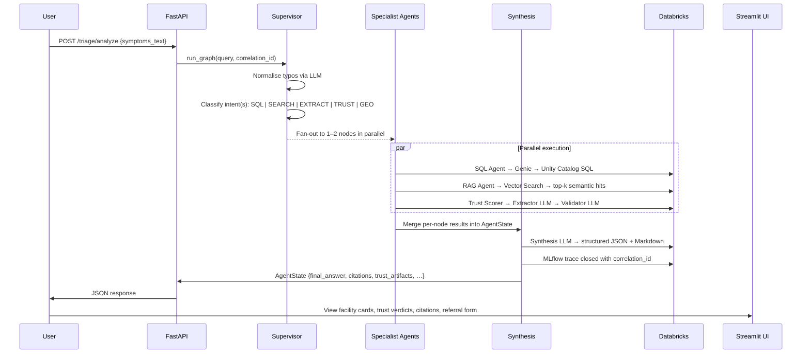

# CareCompass India 🧭

> **Agentic healthcare intelligence for 1.4 billion lives.**
> Multi-agent LangGraph pipeline on Databricks — turning messy facility data into triage decisions, trust verdicts, and policy-grade desert maps.

**Live app:** https://hack-nation-india.streamlit.app &nbsp;|&nbsp; **GitHub:** https://github.com/alijafarkamal/Hack-Nation
**Challenge:** Hack-Nation × Databricks 2026 — *Serving a Nation*

---

## System Architecture

```mermaid
flowchart TD
    U([User / NGO Planner]) -->|Natural language query| ST[Streamlit Frontend\n5-tab dashboard]
    ST -->|HTTPS + X-Request-Id| MW[FastAPI + Correlation\nID Middleware]
    MW --> TS[/triage/analyze\n/triage/match_facilities]
    MW --> PS[/policy/deserts\n/policy/pin-risk]
    MW --> RS[/referral/preview\n/referral/send]
    MW --> ES[/enrichment/facility]

    TS --> LG[LangGraph StateGraph]
    PS --> LG

    subgraph LangGraph Multi-Agent Pipeline
        LG --> SV[Supervisor Node\nNormalise + Intent classify]
        SV -->|fan-out: up to 2 parallel| SQL[SQL Agent\nDatabricks Genie]
        SV -->|fan-out| RAG[RAG Agent\nVector Search]
        SV -->|fan-out| IDP[IDP Extraction\nStructured JSON from text]
        SV -->|fan-out| TR[Trust Scorer\nExtractor → Validator]
        SV -->|fan-out| GEO[Geospatial Agent\nHaversine + Deserts]
        SQL --> SY[Synthesis Node\nJSON → Markdown + Citations]
        RAG --> SY
        IDP --> SY
        TR --> SY
        GEO --> SY
    end

    subgraph Databricks Platform
        SQL --> GN[Genie\nText-to-SQL]
        RAG --> VS[Vector Search\ngte-large-en embeddings]
        TR --> MS[Model Serving\nQwen 3 80B]
        IDP --> MS
        SV --> MS
        SY --> MS
        GN --> UC[Unity Catalog\nDelta Tables — 10k facilities]
        VS --> UC
        SY --> ML[MLflow 3\nPer-node @mlflow.trace]
    end

    RS --> TW[Twilio SMS\nor mock fallback]
    ES --> TAV[Tavily Web Search\nContact enrichment]
```

---

## Agent Decision Flow



---

## What CareCompass Does

India has **10,002 healthcare facilities** across 36 states/UTs — recorded across 41 columns of messy CSV data, with free-form text descriptions, missing geolocation, inconsistent capability fields, and zero standardised coverage reporting. A patient or NGO planner cannot answer *"Where is the nearest ICU in Bihar with a trust-verified surgical capability?"* without:

1. A pipeline that understands **natural language** and corrects typos
2. Agents that search **structured SQL** tables and **unstructured semantic** embeddings simultaneously
3. A **multi-pass verification system** that flags contradictions between claimed and evidenced capabilities
4. **Statistical coverage maps** that quantify *uncertainty* — not just gap existence

CareCompass solves all four.

---

## Tech Stack

| Layer | Technology | Role |
|-------|-----------|------|
| **Agent orchestration** | LangGraph 1.0 `StateGraph` | Supervisor → parallel fan-out → synthesis |
| **LLM inference** | Databricks Model Serving (Qwen 3 80B) | All LLM calls via served endpoint |
| **Structured queries** | Databricks Genie (Text-to-SQL) | Natural language → SQL over Unity Catalog |
| **Semantic retrieval** | Databricks Mosaic AI Vector Search | `databricks-gte-large-en` embeddings |
| **Observability** | MLflow 3 | Per-node `@mlflow.trace`, correlation ID propagation |
| **Structured storage** | Databricks Unity Catalog | Delta tables — 10,002 facilities, 9,866 valid PINs |
| **Backend API** | FastAPI + Pydantic + Uvicorn | REST layer, `X-Request-Id` middleware |
| **SMS referral** | Twilio | Real SMS with mock fallback |
| **Web enrichment** | Tavily Search API | Contact details from public web |
| **Frontend** | Streamlit (5 tabs) | Deployed on Streamlit Community Cloud |
| **Maps** | Folium + streamlit-folium | Interactive heatmap + desert overlays |
| **Charts** | Plotly Express / Graph Objects | Coverage charts, trust gauges, Wilson CI |
| **PDF reports** | fpdf2 + Kaleido/Matplotlib | Downloadable mission planning reports |
| **Statistics** | Wilson Score Interval | Sparse-data confidence for desert proportions |
| **LLM fallback** | OpenRouter (Minimax M2.1) | When Databricks endpoint is unavailable |
| **Testing** | pytest | Unit, integration, end-to-end |

---

## Deep-Dive: Every Agent Node

### 1. Supervisor Node (`src/nodes/supervisor.py`)

**Two-stage LLM gate before any data access:**

```
Stage 1 — Normalise:
  "hopital bihar emrgency" → "Which hospitals in Bihar offer emergency care?"
  Uses domain-aware prompt with medical terminology and Indian geography.

Stage 2 — Intent classify:
  Returns 1 or 2 of: SQL | SEARCH | EXTRACT | TRUST | GEO
  Composite queries → parallel fan-out:
    "Cardiology deserts in UP" → ["GEO", "SQL"]
    "ICU facilities with suspicious equipment claims" → ["TRUST", "SEARCH"]
```

`route_by_intents()` returns a `list[str]` — LangGraph's `add_conditional_edges` executes all returned nodes **in parallel** as independent branches, converging at `synthesis`.

---

### 2. SQL Agent (`src/nodes/sql_agent.py`)

Calls **Databricks Genie** with the normalised query. Genie generates SQL against the Unity Catalog Delta table (10k facilities × 41 columns), returns structured rows. The agent wraps results with row-level citations (`source: "genie"`, `facility`, `field`, `evidence_snippet`).

---

### 3. RAG Agent (`src/nodes/rag_agent.py`)

Queries **Databricks Mosaic AI Vector Search** using `databricks-gte-large-en` embeddings. Returns semantic top-k hits on facility descriptions and unstructured notes. Each hit becomes a citation with a confidence score. Handles schema drift gracefully — unknown columns are surfaced as warnings, not failures.

---

### 4. IDP Extraction Node (`src/nodes/idp_extraction.py`)

**Intelligent Document Parsing** over free-form facility text. LLM prompt extracts structured JSON:
- Procedures, equipment, specialties
- Operating hours, bed capacity
- Key capability phrases verbatim from source text

Returns `extraction_result` dict — the only way to get structured facts from unstructured description fields.

---

### 5. Trust Scorer — Three-Layer Verification (`src/nodes/trust_scorer.py`)

The flagship feature. Every facility recommendation is put through an adversarial verification pipeline before the UI renders it.

**Layer 1 — Deterministic rules** (`src/utils/trust_rules.py`):
```
surgery/OT claim + no anaesthesia in any text field  → score × 0.70, flag raised
ICU/critical claim + no ventilator/monitor evidence  → score × 0.75, flag raised
cardiac center + equipment list < 40 characters      → score × 0.65, flag raised
all structured fields empty + description < 30 chars → score × 0.85, flag raised
```

**Layer 2 — Extractor LLM (Pass 1):**
Receives raw facility JSON. Returns per-facility:
- `extracted_claims[]` — bullet facts grounded only in the record (no hallucination)
- `uncertainty_0_1` — how much the model trusts its own extraction
- `key_evidence_phrase` — shortest verbatim quote from source text

**Layer 3 — Validator LLM (Pass 2):**
Receives Pass 1 output + original data. Cross-references against medical operations sanity:
- Surgery needs documented OT/anesthesia
- ICU needs ventilator or monitoring equipment
- 24/7 emergency needs explicit statement
Returns `contradiction_flags[]`, `validator_score_0_1`, `verdict_suggestion`

**Combined score merge + disagreement detection:**
```python
combined = 0.45 × deterministic + 0.35 × validator_score + 0.20 × (1 − uncertainty)

if disagreement(extractor, validator):  combined × 0.85
if any flags:                           combined × 0.90

final_verdict:
  combined < 0.35 → SUSPICIOUS  🔴
  combined < 0.55 → REVIEW      🟡
  combined ≥ 0.55 → VERIFIED    🟢  (downgraded to REVIEW if disagreements)
```

All artifacts (`per_facility`, extractor/validator raw, `disagreements`, `all_flags`) stored in `trust_artifacts` → surfaced in UI per facility card with badges and evidence snippets.

---

### 6. Geospatial Agent (`src/nodes/geospatial.py`)

- **Medical desert detection:** for any specialty, scans all 36 states/UTs for zero-coverage regions
- **Haversine distance search:** facilities within N km of a given PIN centroid
- **PIN-level risk:** aggregates facility count + Wilson CI for a 6-digit PIN code
- **Wilson Score Interval:** on sparse data, reports `point`, `low_95`, `high_95` — not a fabricated precise number

---

### 7. Synthesis Node (`src/nodes/synthesis.py`)

Receives merged `AgentState` from all parallel branches. Two-stage output:

```
Stage 1 → Structured JSON (machine-readable):
  { answer_markdown, evidence_table[], citations[], confidence_0_1, data_quality_notes }

Stage 2 → Rendered Markdown:
  Headings + bullets with facility names, states, PIN codes — no invented geographies.
```

All citations carry `source`, `facility`, `field`, `evidence_snippet`, `confidence` — the full agentic traceability chain.

---

## Observability: MLflow 3 Tracing

Every node is decorated:

```python
@mlflow.trace(name="supervisor_node", span_type="AGENT")
@mlflow.trace(name="trust_scorer_node", span_type="AGENT")
@mlflow.trace(name="synthesis_node", span_type="AGENT")
# … all 7 nodes + run_agent()
```

A `ContextVar`-based `correlation_id` (UUID) is:
- Set on graph invoke
- Propagated through every `AgentState` dict
- Tagged on every MLflow span
- Returned in every API response (`correlation_id` field)
- Shown in the Streamlit UI under "Agentic Traceability — Chain of Thought Citations"

Judges can copy the `correlation_id` from the UI and search it in the Databricks MLflow UI to inspect the full multi-agent execution trace, per-node inputs/outputs, and latency breakdown.

---

## FastAPI Backend

**Base URL:** `http://localhost:8000` (local) or your deployed URL

| Endpoint | Method | Description |
|----------|--------|-------------|
| `/healthz` | GET | Liveness + Twilio/Tavily config flags |
| `/readiness` | GET | Databricks component health (warehouse, Genie, Vector Search, LLM) |
| `/triage/analyze` | POST | Symptoms → capabilities + red flags + graph summary |
| `/triage/{session_id}` | GET | Retrieve cached triage session |
| `/triage/match_facilities` | POST | Session → facility match with trust scores |
| `/policy/deserts` | GET | Desert states/PINs by specialty + Wilson CI |
| `/policy/pin-risk/{pin}` | GET | PIN-level facility count + high-trust Wilson interval |
| `/referral/preview` | POST | Build referral message (auto-filled from session) |
| `/referral/send` | POST | Send via Twilio or mock |
| `/enrichment/facility` | POST | Tavily web search for phone/website/hours |
| `/enrichment/batch` | POST | Batch enrichment (max 20 facilities) |

**`X-Request-Id` middleware:** reads client-supplied UUID or generates one → injects as `correlation_id` into the graph → returned in all responses → links API call to MLflow trace.

---

## Streamlit Frontend — 5 Tabs

### Tab 1 — Triage & Matching
- One-form UX: symptoms + region → single button runs the full two-step pipeline (analyze → match)
- **Capabilities needed** + **Clinical red flags** extracted and badged
- **Multi-Agent Truth Verification:** per-facility cards with VERIFIED / REVIEW / SUSPICIOUS verdict, contradiction flags, deterministic trust score, evidence snippet (exact text), extractor/validator disagreement indicators
- **Web enrichment** per facility (Tavily → phone, website, hours) with confidence score + "verify before use" disclaimer
- **Inline referral form** opens under "Refer this facility" — pre-filled with facility name, phone, patient summary from symptoms, red flags from triage session
- **`mailto:` deep link** for patient arrival coordination email
- **"View Agent Logic"** expander — step-by-step trace: query received → vector search size → flags found → recommendation

### Tab 2 — Mission Planner
- National dataset snapshot: 10,002 facilities, 9,866 valid PINs
- Specialty selector → desert analysis at `state` or `pin` level
- **Wilson Score CI gauge** — low/high confidence bands on desert proportions
- **PIN risk lookup** — 6-digit PIN → facility count + high-trust Wilson interval + sample facilities
- **Downloadable PDF report** — executive summary, embedded Plotly charts (Kaleido; matplotlib fallback), policy citations, facility lists

### Tab 3 — Desert Map
- Full-width Folium map, centred on India
- **HeatMap layer** — desert pressure intensity by state (PIN density distribution)
- **Red circles** at state centroids — radius proportional to estimated desert PIN share
- **Green circles** — covered states for selected specialty
- **Coverage gap chart** below map — horizontal bar chart of desert states (PIN counts at `pin` level; presence indicator at `state` level)
- Live specialty + level selectors — map updates automatically, no button needed

### Tab 4 — Query Analytics
- Session-scoped log of all triage queries
- Capability frequency chart (what are planners looking for most?)
- CSV + PDF export of query log

### Tab 5 — System Architecture
- Interactive force-directed graph (vis.js via streamlit-agraph or CDN vis-network embed)
- All 7 agent nodes, 5 Databricks services, 4 UI surfaces — colour-coded by layer
- Metrics: agent nodes, Databricks services, UI surfaces, graph edges, observability platform

---

## Data Pipeline

```
Raw CSV (10,002 facilities × 41 columns)
  │
  ├── Pandas normalisation:
  │     Facility type standardisation, region name fuzzy-matching,
  │     coordinate lookup for facilities missing geolocation,
  │     specialty categorisation, typo correction
  │
  ├── Parquet → Databricks Unity Catalog (Delta table)
  │     Full schema documented for Genie; Change Data Feed enabled
  │
  └── Auto-synced Vector Search index
        databricks-gte-large-en embeddings on facility descriptions
        + specialties + procedure fields (unstructured text)
```

Single source of truth: SQL-queryable structured fields **+** semantic search on unstructured text — same dataset, two access patterns, one Unity Catalog table.

---

## Getting Started

### Prerequisites
- Python 3.11+
- Databricks workspace with: Genie space, Vector Search index, Model Serving endpoint, Unity Catalog table
- `.env` from `.env.example`

### 1. Clone

```bash
git clone https://github.com/alijafarkamal/Hack-Nation.git
cd Hack-Nation
```

### 2. Configure

```bash
cp .env.example .env
# Fill in DATABRICKS_HOST, DATABRICKS_TOKEN, GENIE_SPACE_ID,
# VECTOR_SEARCH_ENDPOINT_URL, VECTOR_SEARCH_INDEX_NAME,
# LLM_ENDPOINT, and optionally TAVILY_API_KEY + Twilio vars
```

### 3. Run the backend API

```bash
pip install -r requirements.txt
uvicorn backend_api.main:app --reload --host 0.0.0.0 --port 8000
# API docs: http://localhost:8000/docs
```

### 4. Run the Streamlit frontend

```bash
cd frontend
pip install -r requirements.txt
export API_BASE_URL="http://127.0.0.1:8000"
streamlit run app.py
```

### 5. Run tests

```bash
pytest  # from repo root
```

Tests cover: Haversine geospatial math (unit), Databricks service connectivity (integration), full LangGraph graph execution (end-to-end).

---

## Graceful Degradation

CareCompass is designed to **always** provide value, even when services are partially unavailable:

| Failure mode | Behaviour |
|---|---|
| Databricks Vector Search down | SQL + IDP agents still run; `degraded_components` shown in banner |
| Genie / SQL warehouse unavailable | RAG + Trust agents run; banner explains partial results |
| LLM endpoint unavailable | OpenRouter (Minimax M2.1) fallback is used automatically |
| Twilio not configured | Referral runs in `mock` mode; `mode` field displayed in UI |
| Tavily not configured | Enrichment returns 503 with friendly message; rest of UI unaffected |
| Kaleido not installed | PDF charts exported via matplotlib fallback |
| `streamlit-agraph` not installed | Architecture graph falls back to CDN vis-network embed |

---

## Repository Structure

```
hack-nation/
├── src/                        # LangGraph agent core
│   ├── graph.py                # StateGraph definition + run_graph()
│   ├── state.py                # AgentState TypedDict
│   ├── citations.py            # Citation normalisation
│   ├── trace_context.py        # ContextVar for correlation_id
│   ├── nodes/
│   │   ├── supervisor.py       # Normalise + intent classify
│   │   ├── sql_agent.py        # Databricks Genie
│   │   ├── rag_agent.py        # Vector Search
│   │   ├── idp_extraction.py   # Structured extraction from text
│   │   ├── trust_scorer.py     # Two-pass LLM + deterministic rules
│   │   ├── geospatial.py       # Desert detection + Haversine
│   │   └── synthesis.py        # JSON → Markdown + citations
│   ├── tools/
│   │   ├── model_serving_tool.py
│   │   ├── vector_search_tool.py
│   │   └── genie_tool.py
│   └── utils/
│       └── trust_rules.py      # Deterministic trust rule engine
├── backend_api/                # FastAPI service layer
│   ├── main.py                 # App + CORS + middleware
│   ├── schemas.py              # Pydantic models
│   ├── middleware/
│   │   └── correlation.py      # X-Request-Id injection
│   ├── routes/
│   │   ├── enrichment.py
│   │   └── referral.py
│   └── services/
│       ├── triage_service.py
│       ├── policy_service.py   # Wilson CI desert stats
│       ├── referral_service.py # Twilio integration
│       ├── enrichment_service.py # Tavily integration
│       └── readiness_service.py
├── frontend/                   # Streamlit app
│   ├── app.py                  # 5-tab dashboard (~2400 lines)
│   ├── api_client.py           # Typed FastAPI client
│   ├── map_component.py        # Folium map builder
│   ├── state_centroids.py      # India state lat/lon
│   └── requirements.txt
├── docs/                       # Playbooks, PDFs, integration notes
├── scripts/
│   └── setup_databricks.py    # Automated Databricks provisioning
├── tests/                      # pytest suite
├── .env.example
├── requirements.txt
└── tech.md                     # Engineering slide deck (pitch video)
```

---

## Evaluation Criteria Alignment

| Criterion | Weight | How CareCompass addresses it |
|-----------|--------|------------------------------|
| **Technical accuracy** | 35% | Two-pass LLM trust verification + deterministic rules; row-level citations with exact evidence snippets; MLflow 3 traces per `correlation_id`; graceful degradation with explicit component status |
| **IDP innovation** | 30% | Dedicated IDP Extraction node; synthesis evidence table; extractor/validator adversarial debate; structured JSON before Markdown render |
| **Social impact** | 25% | Full-India medical desert mapping at state + PIN granularity; Wilson CI for statistically sparse regions; mission planner PDF for NGO decision-making; Twilio SMS referral chain |
| **User experience** | 10% | 5-tab Streamlit dashboard; one-click example queries; inline referral form; `mailto:` deep link; live map; downloadable reports |

---

## Disclaimer

CareCompass is a **capability-matching triage assistant**, not a medical diagnosis tool. All outputs are for planning and coordination purposes. In emergencies, seek immediate in-person care.

---

*Built for Hack-Nation × Databricks 2026 — Serving a Nation challenge.*
